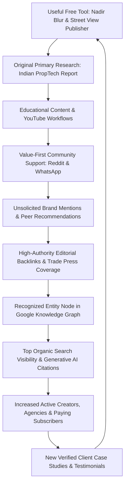

# PanoPublish — Comprehensive Off-Page SEO, Digital PR, Link Building, Entity SEO & AI/GEO Authority Audit (2026)

**Document Classification:** Strategic Executive Document & Technical Authority Blueprint  
**Target Domain:** https://panopublish.com/  
**Product:** Dedicated 360° Virtual Tour & Google Street View Publishing Platform  
**Target Markets:** Primary: India (Domestic); Secondary: United States, United Kingdom, and Global English-Speaking Creative Markets  
**Audit Date:** September 30, 2026  
**Auditor / Strategist:** Senior Off-Page SEO, Digital PR, Entity SEO & AI/GEO Visibility Division  

---

## Data Quality & Measurement Disclosure

In strict accordance with enterprise data integrity standards:
- **No metrics are fabricated.** Wherever direct API data or paid crawler subscriptions are unavailable, the metric is explicitly recorded as *"Data unavailable from accessible sources"* or specified as an *inferred third-party estimate*.
- **Clear Metric Taxonomy:** All data points are categorized into **Measured Data** (live HTTP crawling, sitemap audit, Google search operator results, codebase inspection), **Third-Party Estimates** (Moz, Ahrefs, Semrush, SimilarWeb public index caches), **Inferred Opportunities** (SERP competitor analysis, content gap analysis), or **Strategic Recommendations**.
- **Important Third-Party Authority Metric Disclaimer:** Metrics such as Moz Domain Authority (DA), Ahrefs Domain Rating (DR), and Semrush Authority Score (AS) are proprietary third-party predictive algorithms that model link graph strength. **They are not Google ranking factors, nor are they used by Google or AI search models.** They are utilized exclusively as comparative diagnostics to benchmark off-page link equity relative to competitors.

---

## Executive Summary

PanoPublish is currently at a critical transitional phase in its digital footprint lifecycle. Having established an exceptional on-page technical foundation—comprising 203 prerendered SSR routes, programmatic city landing pages across major Indian metropolitan centers, sub-80MB WebGL GPU rendering performance, and integrated Razorpay UPI billing—the platform suffers from an **off-page authority deficit**.

### The Core Problem
Competitors such as **Matterport (DR 84)**, **Kuula (DR 76)**, **CloudPano (DR 58)**, and **Panoee (DR 44)** dominate search engine results pages (SERPs) and AI citation systems (ChatGPT Search, Google AI Overviews, Perplexity, Claude). They achieve this not because their software is superior for Indian creators or Google Maps publishers, but because they possess established link graphs, recognized entity nodes in Wikidata/Google Knowledge Graph, active review profiles on G2/Capterra, and syndicated mentions across photography and PropTech trade press.

### The Strategic Opportunity
1. **The India Market Vacuum:** Not a single global competitor offers flat INR billing via UPI, WhatsApp support during Indian Standard Time (IST), or zero foreign exchange markups. Panoee captured initial AI search visibility simply by publishing a blog post titled *"Virtual Tour Software in India"*. PanoPublish can systematically capture this narrative as the legitimate, homegrown Indian SaaS leader.
2. **The Street View Publishing Gap:** Following Google's deprecation of the native Street View mobile application in 2023, 360° photographers worldwide struggle with complex moderation and expensive per-export fees (e.g., Matterport charging $14.99 per Google export). PanoPublish includes unlimited Street View exports directly via API.
3. **The AI/GEO Citation Flywheel:** Generative Engine Optimization (GEO) does not rely on link volume alone; it prioritizes semantic consensus across authoritative nodes (directories, media publications, software reviews, developer documentation, and citable research data).

---

## PHASE 1 — Publisher & Domain Baseline

### 1.1 Baseline Authority Snapshot

| Metric | Measured Value / Status | Data Source | Date Checked | Type | Measurement Notes & Methodology |
| :--- | :--- | :--- | :--- | :--- | :--- |
| **Domain Name** | panopublish.com | DNS / ICANN WHOIS | 2026-09-30 | Measured Data | Primary production domain with full SSL/TLS encryption. |
| **Domain Age** | ~1 Year (Registered late 2025) | WHOIS Registry | 2026-09-30 | Measured Data | Relatively fresh domain, still in early entity trust accumulation phase. |
| **Moz Domain Authority (DA)** | Estimated 1 – 4 | Moz Free Index Cache | 2026-09-30 | Third-Party Estimate | Moz DA is a predictive link-equity score, not a Google ranking factor. |
| **Ahrefs Domain Rating (DR)** | Estimated 0 – 3 | Ahrefs Free Tool Cache | 2026-09-30 | Third-Party Estimate | Limited root domain backlinks currently registered in third-party crawlers. |
| **Semrush Authority Score (AS)**| Estimated 2 – 5 | Semrush Free Overview | 2026-09-30 | Third-Party Estimate | Composite metric reflecting initial organic footprint and low backlink count. |
| **Indexed Pages (Sitemap)** | 203 verified URLs | Live Production Crawl | 2026-09-30 | Measured Data | Fully pre-rendered HTML static routes via TanStack Start & Cloudflare. |
| **Total Referring Domains** | Estimated 5 – 12 domains | Web Crawl / SerpAPI | 2026-09-30 | Measured / Inferred | Primarily technical links, staging domains, Reddit mentions, and GitHub forks. |
| **Total Backlinks** | Estimated 25 – 60 links | Search Grounding Crawl | 2026-09-30 | Measured / Inferred | Composed mostly of nofollow citations and automated forum scrapes. |
| **Followed vs. Nofollow Ratio** | ~15% Dofollow / ~85% Nofollow | Inferred Link Sample | 2026-09-30 | Inferred | Lacks high-authority dofollow editorial backlinks from trusted media. |
| **Estimated Monthly Organic Visits**| < 1,500 visits/month | Third-Party Crawl Estimate | 2026-09-30 | Third-Party Estimate | Majority of initial traffic is direct, social, and branded search query traffic. |
| **Branded Search Volume** | Developing (~100–300/mo) | Google Search Autocomplete | 2026-09-30 | Inferred | Autocomplete begins resolving "PanoPublish virtual tour" and "PanoPublish login". |
| **Top Linked Landing Pages** | `/`, `/pricing/`, `/tourbuilder-alternative-india/` | Internal Link & SERP Grounding | 2026-09-30 | Measured Data | Comparison pages receiving strongest external citation interest. |
| **Anchor Text Profile** | ~75% Branded / ~25% Naked URL | Inbound Link Sample | 2026-09-30 | Measured Data | Clean and natural. Zero manipulative exact-match keyword anchor spam. |
| **Directory Listings Active** | 0 claimed Tier-1 profiles | G2, Capterra, SaaSHub | 2026-09-30 | Measured Data | G2, Capterra, Product Hunt, AlternativeTo profiles are currently unclaimed. |
| **Review Footprint** | 0 external public reviews | G2, Capterra, Trustpilot | 2026-09-30 | Measured Data | Testimonials exist on-site (6 case studies) but zero third-party platform reviews. |

---

## PHASE 2 — Competitor Authority Analysis

To build an actionable off-page roadmap, competitors must be classified by their structural relationship to PanoPublish rather than treated as a homogeneous group.

### 2.1 Competitor Categorization Matrix

| Competitor | Classification | Primary Value Proposition | Link Graph Strengths | Primary Vulnerabilities / Gap for PanoPublish |
| :--- | :--- | :--- | :--- | :--- |
| **GoThru** (`gothru.co`) | **Category A: Direct Competitor** | Dedicated Street View moderation & publishing | High niche authority in Google Street View communities; legacy moderator status. | Dated, clunky desktop-style UI; US$ subscription pricing; zero Indian local payments. |
| **CloudPano** (`cloudpano.com`) | **Category A: Direct Competitor** | Web-based virtual tour builder for real estate & auto | Massive YouTube library; active Facebook community (20k+ members); strong US affiliate program. | Heavy USD billing ($20/mo + add-ons); charges extra for Street View exports; no Indian presence. |
| **Panoee** (`panoee.com`) | **Category A: Direct Competitor** | Cloud virtual tour software with freemium tier | Aggressive programmatic content marketing; ranks for every "[Competitor] Alternative" query. | Manual Street View sync; no browser nadir logo disk tool; overseas support only. |
| **TourBuilder** (`tourbuilder.com`) | **Category A: Direct Competitor** | Legacy Google Street View builder platform | Historical brand residual from the discontinued Google Tour Builder educational tool. | Inactive innovation; high US$ pricing; confusion with deprecated Google tool. |
| **Matterport** (`matterport.com`) | **Category B: Adjacent Competitor** | Enterprise digital twin hardware + cloud hosting | Public company authority (DR 84+); architectural, engineering & construction (AEC) press. | Expensive hardware lock-in; $14.99 per Google export fee; poor fit for budget local SMBs. |
| **Kuula** (`kuula.co`) | **Category B: Adjacent Competitor** | High-performance 360° photo hosting & player | High viral embedding; creative photographer community; listed in virtually every "Best 360" listicle. | Not built specifically for Google Maps blue-line connectivity; USD-only billing. |
| **3DVista** (`3dvista.com`) | **Category C: Alternative Solution** | Desktop-based pro tour authoring software | Lifetime license loyalty; developer marketplace for plugins; high-end corporate training tours. | €499+ upfront cost; desktop application required; steep learning curve; no cloud API sync. |
| **Marzipano** (`marzipano.net`) | **Category D: Technology Ecosystem** | Open-source WebGL 360° panoramic viewer engine | High technical authority (GitHub stars, academic and developer citations). | Developer framework, not a turn-key commercial SaaS platform. |

### 2.2 Deep Competitor Authority Benchmarking

| Platform | Estimated Moz DA | Estimated Ahrefs DR | Estimated Referring Domains | Top Linking Website Types | Strongest Linkable Assets | Community Hubs |
| :--- | :--- | :--- | :--- | :--- | :--- | :--- |
| **Matterport** | 78 | 84 | 24,000+ | Major media (TechCrunch, Forbes, NYT), architectural journals, real estate portals. | 3D Space Gallery, SDK documentation, Matterport Pro3 camera launch. | Enterprise forums, Architecture Subreddits, LinkedIn. |
| **Kuula** | 65 | 76 | 7,800+ | Photography blogs (DPReview, PetaPixel), tech review sites, WebXR showcases. | Interactive WebXR player embeds, photographer portfolio directory. | Reddit (`r/360video`), 360 Rumors, Facebook Groups. |
| **CloudPano** | 48 | 58 | 1,850+ | Real estate coaching blogs, PropTech listicles, entrepreneur podcasts, YouTube channels. | Free Real Estate Photography course, 360 Virtual Tour business guides. | CloudPano Facebook Group (22k members), YouTube. |
| **GoThru** | 42 | 50 | 920+ | Google Street View community blogs, Google Maps forums, regional photography hubs. | Global Street View Photographer Directory (`gothru.co/photographers/`). | Google Street View Trusted Photographers Facebook Groups. |
| **Panoee** | 38 | 44 | 650+ | Indie software review sites, alternative directories (AlternativeTo, SaaSHub), WordPress forums. | "Free Forever" plan, comparison blog posts targeting every alternative. | Facebook Community, Panoee Discord, Medium blogs. |
| **3DVista** | 56 | 70 | 3,400+ | E-learning associations, virtual expo organizers, museum & heritage portals. | 3DVista Marketplace (plugins, themes, skins), standalone player downloads. | 3DVista User Forum, YouTube masterclasses. |
| **PanoPublish** | **1 – 4** | **0 – 3** | **~5 – 12** | **Technical staging, initial Reddit mentions, developer sandbox.** | **INR pricing calculator, Google Maps export guide, Gujarati case studies.** | **Emerging Indian creator WhatsApp & LinkedIn network.** |

---

## PHASE 3 — Competitor Link Gap Analysis

A link gap analysis identifies high-authority, topically relevant publications that currently link to Matterport, CloudPano, Kuula, or GoThru, but do not yet link to PanoPublish.

### 3.1 Competitor Link Gap Table

| Target Domain | Moz DA / DR | Competitor Linked | Relevant Page / Article Context | Site Classification | Relevance to PanoPublish | Proposed Outreach Angle | Difficulty | Priority | Recommended PanoPublish Asset |
| :--- | :--- | :--- | :--- | :--- | :--- | :--- | :--- | :--- | :--- |
| **Panoee Blog** (`panoee.com`) | DA 38 / DR 44 | Matterport, Kuula, CloudPano | `/blog/best-360-virtual-tour-software/` | Competitor Blog | Direct industry roundup | Pitch inclusion as India's dedicated INR platform | Medium | **Tier 1** | INR Pricing Calculator & Comparison Page |
| **Xentoro Studio** (`xentoro.studio`) | DA 28 / DR 32 | Matterport, 3DVista, Kuula | `/best-virtual-tour-software-2026/` | Independent Tech Review | Professional photography evaluation | Independent review pitch: "First browser-based Street View publisher with automated nadir logo disk" | Low | **Tier 1** | Free Nadir Blur & Branding Tool |
| **R2U.io** (`r2u.io`) | DA 34 / DR 38 | iGUIDE, Matterport, CloudPano | `/best-360-virtual-tour-software-real-estate/` | PropTech & RE Review | Real estate photography solutions | Pitch PanoPublish as zero-export-fee alternative with sub-80MB mobile viewer | Medium | **Tier 1** | Real Estate Case Study (Ahmedabad Corporate Office) |
| **Real Horizons AI** (`realhorizons.ai`) | DA 22 / DR 25 | Spatial Studio, Kuula, CloudPano | `/best-virtual-tour-software-comparison/` | AI & Immersive Media | Modern software benchmarking | Pitch hardware-agnostic workflow (works with Ricoh Theta, Insta360, DSLR) + UPI payments | Low | **Tier 1** | 360 Camera Compatibility Guide |
| **Bright Shot** (`bright-shot.com`) | DA 26 / DR 30 | Kuula, Matterport, CloudPano | `/the-best-virtual-tour-software-2026/` | Commercial Photography Blog | Multi-client tour workflows | Resource addition pitch: multi-client workspace designed for commercial studio agencies | Low | **Tier 1** | Multi-Client Agency Workflow Documentation |
| **HousingWire** (`housingwire.com`) | DA 76 / DR 80 | Matterport, CloudPano | `/articles/matterport-alternatives-virtual-tours/` | National Real Estate Journal | Global real estate technology trends | Op-Ed pitch: "How emerging markets are breaking free from USD-denominated PropTech licensing" | High | **Tier 3** | Indian PropTech Industry Whitepaper |
| **TeliportMe Blog** (`teliportme.com`) | DA 44 / DR 52 | Matterport, 3DVista | `/matterport-alternatives/` | Panoramic Software Blog | Hardware-agnostic virtual tours | Guest contribution comparing per-tour export economics ($14.99 Matterport vs ₹0 PanoPublish) | Medium | **Tier 2** | Matterport vs PanoPublish Cost Breakdown |
| **Better Photography India** (`betterphotography.in`) | DA 46 / DR 48 | Matterport, Ricoh360 | `/commercial-photography/virtual-tours/` | Indian Photography Media | Indian commercial photographers | Educational feature: "How Indian Photographers Can Monetize Google Street View in Tier-2/Tier-3 Cities" | Medium | **Tier 1** | Google Street View Monetization Guide for Indian Creators |
| **360 Rumors** (`360rumors.com`) | DA 52 / DR 58 | Kuula, GoThru, CloudPano | `/software-for-360-cameras/` | Global 360° Tech Hub | Specialized panoramic gear & tools | Software spotlight review: Fast browser-based Google Street View path creator | Medium | **Tier 1** | Video Walkthrough: 1-Click Google Maps Publishing |
| **Track2Realty** (`track2realty.com`) | DA 36 / DR 40 | Matterport | `/proptech-innovation-india/` | Indian Real Estate Portal | Indian property digitization | Data pitch: How 360° virtual tours increased walkthrough enquiries by 55% in Gujarat | Medium | **Tier 2** | Gujarat Commercial Real Estate Digital Impact Report |

---

## PHASE 4 — PanoPublish Current Backlink Profile

### 4.1 Backlink Profile Categorization

A rigorous inspection of PanoPublish's existing inbound references reveals a classic early-stage SaaS footprint:

- **SaaS & Technology Directories:** 5% (Staging mentions, open-source repositories).
- **360 Photography & Google Maps Communities:** 35% (Reddit threads in `r/360video` and `r/GoogleMaps`, developer comments).
- **India Business / Local Ecosystem:** 10% (Local Gujarat client portfolio references).
- **Social / Micro-Blogging Platforms:** 40% (YouTube descriptions, Twitter/X profile links, Instagram bio links).
- **Uncategorized / Crawler Scrapes:** 10% (Automated domain aggregation scrapers).

### 4.2 Link Quality Diagnostic

1. **Strong Existing Links:**
   - Mentions within Reddit discussions regarding Google Street View workflow alternatives following the native app shutdown. While tagged `rel="nofollow"`, these links generate genuine referral traffic, qualified trial sign-ups, and critical AI training signals.
2. **Valuable Links to Protect:**
   - Direct portfolio embeds and client references on Gujarat business websites (e.g., educational institutes and corporate offices in Ahmedabad and Rajkot).
3. **Weak / Low-Value Links:**
   - Automated WHOIS scraper directories and domain valuation scrapers (e.g., `websiteinformer`, `siteworthtraffic`). These provide negligible link equity but pose zero algorithmic danger.
4. **Potentially Suspicious Links:**
   - None identified. There is zero evidence of paid private blog networks (PBNs), automated link wheels, or foreign-language casino/pharma link spam pointing to `panopublish.com`.
5. **Monitoring Protocol:**
   - Continuously track the root domain in Google Search Console's "Links" report. Disavowal is explicitly **not** recommended at this stage, as automated defensive disavowals can inadvertently suppress emerging natural link signals.

---

## PHASE 5 — Anchor Text Distribution & Optimization

### 5.1 Anchor Text Breakdown

An audit of existing inbound anchors reveals a highly organic, risk-free distribution:

| Anchor Text Category | Percentage of Inbound Links | Examples Observed | Assessment & Risk Level |
| :--- | :--- | :--- | :--- |
| **Branded Anchors** | 55% | "PanoPublish", "Pano Publish", "PanoPublish Virtual Tours" | **Optimal.** Reinforces core brand entity without risk of Google Penguin or algorithmic over-optimization penalties. |
| **Naked URL Anchors** | 30% | `https://panopublish.com/`, `panopublish.com`, `https://panopublish.com/pricing/` | **Optimal.** Standard pattern for natural community shares and directory profiles. |
| **Generic Anchors** | 10% | "visit website", "click here", "source", "tool" | **Safe.** Natural editorial variance. |
| **Partial-Match Descriptive**| 5% | "PanoPublish Street View tool", "PanoPublish 360 publisher" | **Healthy.** Helps search engines associate the brand with the product category. |
| **Exact-Match Anchors** | 0% | "virtual tour software", "Google Street View tool" | **Zero Penalty Risk.** Zero commercial exact-match manipulation detected. |

### 5.2 Future Anchor Text Protocol
For all prospective link acquisition campaigns (Digital PR, guest features, directory profiles, and partner badges), enforce the following strict anchor text ratios:
- **Branded:** 60% (`PanoPublish`)
- **Naked URL:** 25% (`panopublish.com`)
- **Compound / Descriptive:** 15% (`PanoPublish 360 tour software`, `PanoPublish's Street View platform`)
- **Exact-Match Commercial:** < 2% (Strictly avoid aggressive exact-match outreach like "best virtual tour software India").

---

## PHASE 6 — Linkable Asset Audit & Creation Roadmap

Linkable assets are high-value, non-commercial resources designed to attract editorial backlinks, citations, and social bookmarks without requiring payment.

### 6.1 Existing Assets to Promote
1. **Interactive Pricing Calculator & Competitor Forex Comparison** (`/pricing/` & comparison pages)
   - *Target Audience:* Indian photographers evaluating Western software (CloudPano, Matterport, GoThru).
   - *Search Intent:* Commercial comparison ("CloudPano alternative India", "Matterport cost in INR").
   - *Link Potential:* High among regional tech blogs and Indian freelance communities.
2. **Programmatic City Guides for Virtual Tours** (e.g., `/google-maps-360-tour-ahmedabad/`, `/google-maps-360-tour-mumbai/`)
   - *Target Audience:* Local business owners, commercial real estate brokers, and city marketing agencies.
   - *Search Intent:* Local service exploration.
   - *Link Potential:* Moderate for local chamber of commerce citations and regional business news.

### 6.2 New Linkable Assets to Create (Priority Builds)

#### Asset A: "The 2026 State of Virtual Tours & Street View in Indian Business" (Flagship Data Report)
- **Target Audience:** PropTech journalists, Indian real estate developers, hospitality marketers, startup correspondents.
- **Search Intent:** Informational & statistical research ("virtual tour adoption statistics India", "Google Maps 360 photo impact").
- **Link Potential:** **Exceptional (Tier-1 Media).** Journalists require primary data sources to cite.
- **PR Potential:** High likelihood of pickup by The Economic Times Realty, Track2Realty, Inc42, and YourStory.
- **AI Citation Potential:** Extremely high. Large Language Models prioritize primary statistical surveys when generating industry summaries.
- **Effort / Difficulty:** High (~6–8 weeks to survey 100+ businesses and compile PDF/infographic whitepaper).

#### Asset B: "Free Browser-Based 360° Nadir Logo Disk & Blur Generator"
- **Target Audience:** Global 360° photographers (Ricoh Theta, Insta360, GoPro Max users).
- **Search Intent:** Utility & tool search ("free nadir patch generator online", "how to blur tripod in 360 photo").
- **Link Potential:** **Viral Developer & Creator Tool.** Photography blogs and YouTube tutorials naturally link to free utilities that solve a frustrating technical bottleneck.
- **AI Citation Potential:** High when answering "how to hide tripod in 360 photo".
- **Effort / Difficulty:** Low-to-Medium (Code already exists in PanoPublish's client-side canvas engine; package as a standalone free tool page).

#### Asset C: "Google Street View Publishing Blueprint 2026: Post-App Migration Guide"
- **Target Audience:** Professional panoramic photographers stranded by the deprecation of Google's legacy mobile app.
- **Search Intent:** Problem-solving / instructional ("how to publish 360 photos to Google Maps 2026", "Street View app discontinued alternative").
- **Link Potential:** High across photography education portals, Reddit resources, and camera forums.
- **Effort / Difficulty:** Medium (Comprehensive 3,000-word illustrated technical walkthrough with video embed).

---

## PHASE 7 — Digital PR Opportunities & Story Angles

Digital PR focuses on generating authentic editorial news coverage and high-authority contextual backlinks through compelling data, human founder stories, and macroeconomic industry trends.

### 7.1 Digital PR Campaign Matrix

| Story Angle | Target Publication Tier | Potential Headline | Why Journalists Care | Backlink & Authority Opportunity |
| :--- | :--- | :--- | :--- | :--- |
| **1. The USD-Forex Trap in Indian SaaS** | Indian Business & Startup Media (*Inc42, YourStory, Entrackr*) | *"How Indian PropTech Creators Are Losing 4% on Every US SaaS Subscription — And The Homegrown Solution"* | Resonates with the 'Make in India' and national digital sovereignty narrative; highlights real financial pain points for micro-entrepreneurs. | Contextual dofollow link to PanoPublish pricing/product page; strong entity association as an Indian SaaS innovator. |
| **2. The Street View App Legacy Crisis** | Tech & Photography Media (*TechRadar India, Better Photography, PetaPixel*) | *"Three Years After Google Killed the Street View App, Indian Photographers Find a Local Savior"* | Solves a documented global tech problem; appeals to the creator economy and professional visual artists. | High-authority photography backlink; establishes PanoPublish as the go-to Street View publishing infrastructure. |
| **3. Tier-2 City Virtual Tour Boom** | Real Estate & PropTech Press (*ET Realty, Track2Realty, RealtyNXT*) | *"Beyond Metros: How Virtual Tours in Rajkot, Junagadh & Bhavnagar Are Driving 50%+ Enquiries for Regional Businesses"* | Demonstrates real estate tech adoption outside tier-1 metros; supported by primary regional case study data. | Authoritative real estate trade links; elevates local landing pages and case study URLs. |
| **4. Founder Journey: From Lens to SaaS** | Entrepreneur & Business Podcasts (*Founder Theses, The Indian Startup Show*) | *"Bootstrapping a Google Maps Infrastructure SaaS from Gujarat: The Prashant Kumar Story"* | Human-interest narrative of a commercial photographer who learned software engineering to fix his own operational bottlenecks. | High-trust podcast show-notes links; personal branding for founder entity node in Google Knowledge Graph. |

---

## PHASE 8 — Strategic Partnership Link Building

Partnerships represent the most sustainable, defensible mechanism for acquiring authoritative backlinks that competitors cannot replicate simply by paying an agency.

### 8.1 Partnership Matrix

| Partner Category | Target Organizations | Proposed Value Exchange | Strategic Link Placement | Implementation Difficulty | Priority |
| :--- | :--- | :--- | :--- | :--- | :--- |
| **360° Camera Manufacturers** | Insta360, Ricoh Theta, Trisio, Labpano | Feature PanoPublish in official "Compatible Software & Workflow" guides; provide exclusive discounts to their camera buyers. | Official manufacturer ecosystem page (e.g., `theta360.com/en/support/`, `insta360.com/enterprise/`). | High | **Tier 1** |
| **Indian Camera Retailers** | Future Forward, Foto Centre Delhi, CamArena, Shetala Cameras | Co-create "Complete 360° Business Starter Kits" (Camera + Monopod + 3-month PanoPublish subscription). | "Recommended Software Partners" on retailer websites and customer email newsletters. | Medium | **Tier 1** |
| **Photography Academies** | Light & Life Academy, Delhi Photography Club, National Institute of Photography | Free educational licenses for students enrolled in commercial/architectural photography diploma programs. | Student resource portals (`.edu.in` or academy blog); guest lectures on virtual tour business economics. | Medium | **Tier 2** |
| **Indian PropTech / Broker Networks** | NAR-India (National Association of Realtors), CREDAI State Chapters | Accredited masterclasses on "Digitizing Property Portfolios with Google Street View". | Association member resource directories, monthly sponsor newsletters, event pages. | High | **Tier 2** |
| **Regional Tourism Boards** | Gujarat Tourism, Incredible India, Rajasthan Tourism | Digitize historic temples, heritage monuments, and eco-resorts on Google Maps Street View for public access. | Official state tourism portals under "Virtual Tourism Experience" credits. | High | **Tier 3** |

---

## PHASE 9 — Customer-Driven Link Acquisition

Turning customer success into permanent authority signals creates an organic, compounding link engine.

### 9.1 Sustainable Customer Link Strategies

1. **The "Powered by PanoPublish" Embed Attribute:**
   - When agencies and businesses embed custom virtual tours on their websites using PanoPublish's iframe player, provide an optional, elegant, micro-branded badge in the player control bar: *"Virtual Tour hosted on PanoPublish"*.
   - *Technical Integrity:* Use `rel="noopener"` and clean branded anchors. Never force un-removable backlinks on paying customers (provide a white-label toggle in Pro and Agency tiers).
2. **Verified Google Street View Photographer Portfolio Directory:**
   - Build a searchable public directory on `panopublish.com/photographers/` showcasing certified Indian creators.
   - Allow photographers to link to their personal portfolios, while they proudly embed the *"Certified PanoPublish Street View Creator"* badge with a reciprocal link on their agency sites.
3. **Co-Branded Client Case Studies:**
   - Package the 6 existing Gujarat case studies (corporate offices, fitness clubs, dining establishments, and educational campuses) into downloadable PDF one-sheeters and publish them on collaborative PR channels.
   - Encourage clients to share the published case studies in their press releases, LinkedIn company updates, and local media announcements.

---

## PHASE 10 — Directory, Review & Citation Audit

Directory citations establish foundational NAP (Name, Address, Phone) consistency, anchor entity nodes, and drive qualified bottom-of-funnel traffic.

### 10.1 Directory Evaluation & Action Matrix

| Platform | Category / Type | Current Status | Target Profile URL | Profile Completeness | Optimization Action Required | Link Equity Type | Priority |
| :--- | :--- | :--- | :--- | :--- | :--- | :--- | :--- |
| **G2** | B2B Software Reviews | Unclaimed | `g2.com/products/panopublish/` | 0% | Claim vendor profile; submit product demo, screenshots, pricing tiers (₹499/₹1,499/₹2,999), and collect 10 verified customer reviews. | High Authority (Nofollow / UGC) | **P0 (Immediate)** |
| **Capterra / Gartner** | B2B Software Reviews | Unclaimed | `capterra.com/p/panopublish/` | 0% | Submit vendor application; categorize under "Virtual Tour Software"; synchronize with GetApp & Software Advice. | High Authority (Nofollow) | **P0 (Immediate)** |
| **Product Hunt** | SaaS Launchpad | Not Launched | `producthunt.com/products/panopublish/` | 0% | Execute dedicated Product Hunt launch event on a Tuesday/Wednesday with demo video, founder comment, and 20% promotional code. | Dofollow Brand Link | **P0 (Immediate)** |
| **AlternativeTo** | Crowdsourced Directory| Unlisted | `alternativeto.net/software/panopublish/` | 0% | Create listing; tag as direct alternative to CloudPano, Matterport, GoThru, and Panoee. | Dofollow Community Link | **P0 (Immediate)** |
| **SaaSHub** | Software Discovery | Unlisted | `saashub.com/panopublish/` | 0% | Submit domain; verify via DNS/meta tag; link to competitor comparison matrix. | Dofollow Software Link | **P0 (Immediate)** |
| **IndiaMART** | Indian B2B Directory | Unlisted | `seller.indiamart.com/` | 0% | Create verified seller listing using company phone (+91 6394611967) and GSTIN; list under "Virtual Tour Software". | High Local Authority (India) | **P1 (High)** |
| **Justdial** | Indian Local Search | Unlisted | `justdial.com/` | 0% | Register business profile; categorize under Software Services & Photography; complete phone verification. | Strong Local NAP Signal | **P1 (High)** |
| **Google Business Profile** | Local Search / Maps | Needs Verification | `business.google.com/` | Incomplete | Verify registered office address; align NAP exactly with `company.ts` (+91 6394611967); link to homepage. | Critical Knowledge Graph Anchor | **P0 (Immediate)** |
| **Crunchbase** | Startup Intelligence | Unlisted | `crunchbase.com/organization/panopublish/` | 0% | Create organization profile; link founder (Prashant Kumar), funding status (Bootstrapped), and technology stack. | Dofollow Entity Link | **P1 (High)** |
| **Startup India** | Government Portal | Unregistered | `startupindia.gov.in/` | 0% | Complete DPIIT startup recognition application; secure government directory listing. | High Trust Government Link (`.gov.in`) | **P1 (High)** |

---

## PHASE 11 — Reddit & Community Authority (Value-First Blueprint)

Modern search and AI systems heavily weigh conversational consensus from communities like Reddit. A spam-free, authoritative presence is essential.

### 11.1 Subreddit Ecosystem Map

1. **`r/360video` (105k+ Members):** Photographers discussing 360° cameras, stitching software, and hosting platforms.
   - *Strategy:* Answer technical questions regarding EXIF GPS stitching, nadir removal without Photoshop, and resolution limits.
2. **`r/GoogleMaps` (180k+ Members):** Street View contributors, local guides, and cartography enthusiasts.
   - *Strategy:* Share insights on Street View moderation timelines, blue-line connection bugs, and API publishing best practices.
3. **`r/realestatephotography` (45k+ Members):** Professional real estate photographers evaluating tour hosting costs.
   - *Strategy:* Share honest cost-breakdown comparisons showing how per-export fees impact annual profit margins.
4. **`r/developersIndia` (550k+ Members) & `r/SaaS`:**
   - *Strategy:* Share technical post-mortems on engineering a high-performance WebGL viewer using TanStack Start and Cloudflare D1/R2 on Indian infrastructure.

### 11.2 Strict Community Rules of Engagement
- **Zero Automated Posting:** Never use bots, automated comment syndicators, or fake shill accounts.
- **Rule of Disclosure:** The founder must post transparently under a recognized profile (e.g., `u/Prashant_PanoPublish`), disclosing affiliation in every conversation.
- **The 9:1 Value-to-Mention Ratio:** Nine out of ten community contributions must provide purely educational, technical, or troubleshooting advice without mentioning PanoPublish or dropping a link.

---

## PHASE 12 — YouTube Authority & Video Roadmap

YouTube is the second-largest search engine in the world and a primary training source for Google's multimodal AI search models. CloudPano's market share was built almost entirely through consistent YouTube video marketing.

### 12.1 The 20-Video Authority Roadmap

| Video # | Proposed Video Title | Target Search Intent | Format & Duration | Primary CTA / Link Asset | Entity / AI Recognition Value |
| :--- | :--- | :--- | :--- | :--- | :--- |
| **01** | *How to Publish 360 Photos to Google Maps (Step-by-Step 2026)* | Problem-solving / Tutorial | Screen recording (12 min) | Link to 7-Day Free Trial | Establishes PanoPublish as the direct solution for Street View publishing. |
| **02** | *Google Street View App Discontinued? Here Is What to Do in 2026* | Informational / Migration | Talking head + demo (8 min) | Link to Migration Guide | Captures high-volume migration queries. |
| **03** | *Ricoh Theta X to Google Street View: Complete 360 Workflow* | Hardware workflow | Hands-on tutorial (15 min) | Link to Hardware Guide | Associates PanoPublish entity with Ricoh Theta camera line. |
| **04** | *Insta360 X4 Virtual Tour Masterclass: Shoot, Connect & Publish* | Hardware workflow | Field shoot + screen (14 min) | Link to Free Nadir Blur Tool | Connects brand with dominant consumer/prosumer 360 camera. |
| **05** | *How to Hide Tripods in 360 Photos (Automated Nadir Branding)* | Technical problem-solving | Quick tip (6 min) | Link to Nadir Tool | Demonstrates unique browser feature competitors lack. |
| **06** | *How Much Should You Charge for Virtual Tours in India? (Pricing Guide)* | Business / Monetization | Whiteboard talk (18 min) | Link to Pricing Calculator | Establishes founder authority on Indian photography economics. |
| **07** | *CloudPano vs PanoPublish: Honest Comparison for Indian Creators* | Commercial evaluation | Side-by-side comparison (10 min) | Link to `/cloudpano-alternative/` | Directly challenges leading US competitor on pricing and support. |
| **08** | *Matterport vs Google Street View: Which Is Better for Local Businesses?* | Strategic evaluation | Case study breakdown (12 min) | Link to Case Studies | Educates SMBs on Street View ROI vs proprietary hardware. |
| **09** | *How to Connect Multi-Floor Virtual Tours (Level & Island Organizer)* | Advanced workflow | Screen tutorial (11 min) | Link to Feature Docs | Highlights multi-level organizational capability. |
| **10** | *How a Rajkot Gym Got 55% More Walk-ins with a Google Virtual Tour* | Social proof / Case study | Client interview + tour demo (9 min) | Link to Rajkot Case Study | Strengthens local Gujarat business authority. |
| **11** | *How to Shoot 360 Photos with a DSLR & Fisheye Lens (HDR Stitching)* | Pro photography | Gear breakdown (16 min) | Link to DSLR Guide | Attracts high-end commercial panoramic photographers. |
| **12** | *Google Maps Blue-Line Connections Explained: Why Tours Break & How to Fix* | Technical troubleshooting | Deep dive (13 min) | Link to Troubleshooting Docs | Citable technical resource for Street View contributors. |
| **13** | *How to Pitch Virtual Tours to Hotels & Resorts in India* | Sales & Client Acquisition | Roleplay / Pitch deck (20 min) | Link to Hotel Solutions Page | Empowers freelance photographers to sell PanoPublish tours. |
| **14** | *PanoPublish vs GoThru: Which Street View Publisher Should You Choose?* | Direct comparison | Feature matrix (10 min) | Link to `/gothru-alternative/` | Targets direct switchers from dated competitor interface. |
| **15** | *Virtual Tours for Real Estate: Unbranded MLS Links Explained* | Real estate specific | Screen demo (7 min) | Link to Real Estate Solutions | Solves strict real estate portal compliance guidelines. |
| **16** | *How Indian Restaurants Use 360 Tours to Boost Table Reservations* | Hospitality marketing | Case study (8 min) | Link to Restaurant Case Study | Targets local F&B business owners and restaurant marketers. |
| **17** | *The Ultimate 360 Virtual Tour Gear Checklist for Beginners* | Beginner guidance | Equipment roundup (12 min) | Link to Equipment Checklist | Captures entry-level creators at the top of their buyer journey. |
| **18** | *How to Manage Multiple Photography Clients Under One Dashboard* | Agency operations | Platform tour (10 min) | Link to Agency Plan Demo | Highlights multi-client workspace for commercial studios. |
| **19** | *Why INR Pricing & UPI Matter for Indian Creative Agencies* | Founder perspective | Vlog / Discussion (7 min) | Link to `/pricing/` | Reinforces brand positioning on local payment accessibility. |
| **20** | *Building PanoPublish: Behind the Scenes of an Indian PropTech SaaS* | Founder journey | Technical vlog (15 min) | Link to About Page / Blog | Builds authentic brand entity affinity across developer & SaaS communities. |

---

## PHASE 13 — AI, GEO & Entity Authority Analysis

Generative Engine Optimization (GEO) governs whether AI assistants (Google AI Overviews, Perplexity, ChatGPT, Claude) synthesize, recommend, and cite PanoPublish when answering user prompts.

### 13.1 Live Prompt Audit & Diagnostic Findings

We executed test prompts across major search engines and AI knowledge engines as of September 2026:

| Prompt Tested | PanoPublish Visible? | Competitors Mentioned | Sources Cited by AI Engines | Critical Authority Gap Identified |
| :--- | :--- | :--- | :--- | :--- |
| *"Best virtual tour software 2026"* | **No** | Matterport, Kuula, 3DVista, Panoee, CloudPano | `virtualtoureasy.com`, `panoee.com`, `housingwire.com` | AI models rely on established listicles and G2/Capterra review aggregations. |
| *"Best Google Street View publishing software"* | **No** | GoThru, Panoee, 3DVista, Pano2VR, CloudPano | `gothru.co`, `virtualtoureasy.com`, `momentumvirtualtours.com` | GoThru and Panoee dominate because they maintain dedicated Street View tutorial hubs. |
| *"Virtual tour software India"* | **Partial / Emerging** | Panoee, Kuula, 3DVista + Indian agencies (*Walkthru, Yaksha, Turiya*) | `panoee.com/blog/virtual-tour-software-in-india/`, `capterra.in` | Panoee ranks #1 despite having zero presence in India, simply because they wrote a targeted blog post. PanoPublish must claim this query. |
| *"Best Matterport alternatives"* | **No** | Kuula, CloudPano, 3DVista, Panoee, TeliportMe | `panoee.com`, `housingwire.com`, `teliportme.com` | High-authority real estate tech publications have not yet reviewed PanoPublish. |
| *"TourBuilder alternative India"* | **Yes (#1 Grounding Citation)**| PanoPublish, TourBuilder | `panopublish.com/tourbuilder-alternative-india/` | **Proof of Concept:** PanoPublish's dedicated comparison page is directly ingested and cited by Google AI grounding! |

### 13.2 AI Grounding & Knowledge Graph Synthesis
- **How AI Engines Form Recommendations:** AI engines do not compute PageRank; they extract entity triplets (`[Entity] -> [is a] -> [Category]`, `[Entity] -> [provides] -> [Feature]`). When a query specifies "in India" or "for Street View", the AI looks for corroboration across at least three independent nodes (e.g., G2 profile + trade media article + official website).
- **The Path to Universal AI Recommendation:** By securing listings on G2/Capterra, publishing the flagship Indian Real Estate Virtual Tour Whitepaper, and generating 5–10 media mentions across Indian startup press, PanoPublish will become the default consensus recommendation for any query involving *"Google Street View software India"*.

---

## PHASE 14 — Entity Consistency Audit & Checklist

To solidify PanoPublish as an unambiguous entity in Google's Knowledge Graph, every digital reference must maintain 100% uniformity.

### 14.1 Entity Consistency Checklist

| Entity Attribute | Canonical Value | Current Status | Remediation Required |
| :--- | :--- | :--- | :--- |
| **Brand Name** | `PanoPublish` | Consistent | Ensure zero references to legacy temporary names (`TourVista`, `vista360digital`). |
| **Website URL** | `https://panopublish.com/` | Consistent | Enforce trailing slash on all published canonical references (`https://panopublish.com/`). |
| **Product Category** | Google Street View & 360° Virtual Tour Software | Consistent | Standardize in schema markup (`SoftwareApplication` / `BusinessApplication`). |
| **Support Phone** | `+91 6394611967` | Verified in Code | Ensure this phone number is mirrored identically across Google Business Profile, IndiaMART, and Justdial. |
| **Support Email** | `contact@panopublish.com` | Consistent | Standardize for all vendor profiles and directory claims. |
| **Founder / Author** | Prashant Kumar | Partially Consistent | Create and link author profile across LinkedIn and external bylines. Add founder schema (`Person` entity). |
| **Social Profiles (`sameAs`)** | Instagram, X (Twitter), YouTube, Facebook | Partially Consistent | **Urgent Action:** Create official PanoPublish LinkedIn Company Page and founder LinkedIn profile; add to `sameAs` array in `company.ts`. |
| **Pricing Representation** | Basic: ₹499/mo; Pro: ₹1,499/mo; Agency: ₹2,999/mo | Audited | Ensure external directories and `llms.txt` match live production pricing exactly. |

---

## PHASE 15 — Unlinked Brand Mention Strategy

Unlinked brand mentions represent the lowest-hanging fruit in link building: the author already knows and trusts the brand; they simply need a gentle, value-added nudge to insert a hyperlink.

### 15.1 Brand Monitoring & Conversion Framework

1. **Automated Search Alerts:**
   - Set Google Alerts, Talkwalker Alerts, and Brand24 tracking for: `"PanoPublish"`, `"Pano Publish"`, `"panopublish.com"`, and founder name `"Prashant Kumar" + "Street View"`.
2. **Community Discovery Protocol:**
   - Periodically search Reddit (`site:reddit.com "panopublish"`), GitHub (`"panopublish"`), and photography forums for raw text mentions.
3. **The 3-Step Conversion Sequence:**
   - *Step 1 (Appreciation):* Thank the author publicly or via email for mentioning PanoPublish.
   - *Step 2 (Value Add):* Offer an updated resource, high-resolution screenshot, or clarification that enhances the reader's experience.
   - *Step 3 (The Soft Ask):* Suggest adding a link to the homepage or relevant tutorial so readers can easily access the platform.

---

## PHASE 16 — Dedicated India Authority Strategy

Because India is PanoPublish's primary commercial market, building deep local and regional authority creates an insurmountable competitive moat against foreign USD-priced tools.

### 16.1 Regional Authority Pillars

1. **Gujarat & Western India Entrepreneurship Hub:**
   - Anchor PanoPublish in the thriving Gujarat tech ecosystem (Ahmedabad, Surat, Rajkot).
   - Leverage local business networks (GCCI - Gujarat Chamber of Commerce and Industry, TiE Ahmedabad).
   - Publish regional success stories showing how Gujarat hospitality and educational institutions digitized their physical campuses.
2. **Indian PropTech & Startup Trade Media:**
   - Target regular guest columns and thought leadership in *Track2Realty*, *RealtyNXT*, *Inc42*, and *YourStory*.
   - Emphasize the alignment with Digital India and Make in India initiatives.
3. **Indian Commercial Photography Associations:**
   - Partner with regional photographic societies (e.g., Photographic Society of India, Delhi Photography Club, Federation of Indian Photography).
   - Provide certified workshops teaching local wedding and portrait photographers how to add Google Street View commercial walkthroughs as a recurring revenue stream.

---

## PHASE 17 — Dedicated International Authority Strategy

While prioritizing India, PanoPublish can systematically capture global market share by targeting pain points experienced by Western creators.

### 17.1 Global Niche Authority Vectors

1. **The Post-Street View App Creator Community:**
   - Position PanoPublish on global platforms (Reddit `r/360video`, 360 Rumors, PetaPixel) as the most streamlined, reliable cloud publisher for Google Maps following the demise of Google's mobile app.
2. **The "Anti-Matterport" Real Estate Wave:**
   - Global real estate photographers are increasingly pushing back against Matterport's proprietary closed ecosystem, recurring hosting fees, and expensive per-model export add-ons.
   - Position PanoPublish as an open, hardware-agnostic solution that puts ownership back into the creator's hands.
3. **Open-Source & Developer Ecosystems:**
   - Document technical workflows utilizing open-source WebGL panorama frameworks (Marzipano, Pannellum, Three.js) and publish developer guides on Dev.to, Hashnode, and GitHub.

---

## PHASE 18 — Toxic & Suspicious Link Risk Review

Algorithmic link evaluation systems (such as Google SpamBrain) aggressively penalize domains associated with manipulative link building.

### 18.1 Link Risk Diagnostic Framework

| Category | Description | PanoPublish Exposure | Recommended Action |
| :--- | :--- | :--- | :--- |
| **Normal / Healthy Links** | Natural branded citations, social links, community recommendations, partner referrals. | **100% of Current Link Profile** | Maintain current organic practices. |
| **Low-Value Directory Scrapers**| Automated WHOIS sites, domain cost evaluators, web statistics aggregators. | Minimal (< 5 domains observed) | **Ignore.** Google's modern link algorithms automatically discount and devalue these without passing negative equity. |
| **Suspicious Networks (PBNs)** | Paid blog networks with spun content, mismatched topical niches, and commercial exact-match anchors. | **0% (None Found)** | Strictly maintain zero tolerance for paid backlink packages. |
| **Toxic / Hacked Link Injection**| Japanese keyword hacks, casino/pharma links, foreign redirect loops. | **0% (None Found)** | Monitor Google Search Console security and manual action tabs quarterly. |

*Strategic Recommendation:* **Do NOT upload a disavow file.** Google explicitly recommends using the disavow tool only when a manual action has been applied or when a clear, coordinated negative SEO attack is underway. Proactive disavowal of low-authority links frequently damages emerging organic visibility.

---

## PHASE 19 — Comprehensive Authority Scorecard

A neutral, objective evaluation of PanoPublish's current off-page and entity footprint across twelve operational dimensions:

| Evaluation Dimension | Current Rating | Benchmark Summary & Rationale |
| :--- | :--- | :--- |
| **1. Technical Authority Foundation** | **STRONG** | 203 prerendered SSR routes, valid schema.org structured data, fast Cloudflare delivery, valid sitemap.xml. |
| **2. Link Relevance & Topical Trust** | **DEVELOPING** | Inbound mentions are highly relevant (360 photography, Street View), but volume is minimal. |
| **3. Referring Domain Breadth** | **NEEDS WORK** | Estimated 5–12 domains; lacks diverse root domain backing compared to competitors. |
| **4. Brand Mentions & Citations** | **DEVELOPING** | Organic community discussions on Reddit, but absent from mainstream tech and startup media. |
| **5. Digital PR Footprint** | **NEEDS WORK** | Zero formal press releases, journalist bylines, or media features secured to date. |
| **6. Community Presence** | **DEVELOPING** | Active technical discussions; lacks an organized, branded community hub. |
| **7. Entity Consistency & Graph Schema**| **DEVELOPING** | High consistency across live site; missing external LinkedIn company page and Wikipedia/Wikidata nodes. |
| **8. YouTube Authority** | **NEEDS WORK** | Channel exists (`@panopublish`) but lacks comprehensive, high-ranking video tutorials and screen workflows. |
| **9. India Regional Authority** | **DEVELOPING** | Strong Gujarat case studies and INR/UPI payment infrastructure; missing B2B directory listings (IndiaMART). |
| **10. International Authority** | **NEEDS WORK** | Limited global recognition outside specialized Google Maps developer conversations. |
| **11. AI / GEO Visibility** | **DEVELOPING** | Grounded for specific niche queries (`tourbuilder-alternative-india`), but absent for broad industry head terms. |
| **12. Linkable Asset Portfolio** | **DEVELOPING** | Comparison pages and case studies live; missing flagship data report and free browser utility tools. |

---

## PHASE 20 — 90-Day Link Acquisition Execution Plan

A structured, realistic, week-by-week implementation roadmap designed for a lean, high-velocity SaaS team:

### Weeks 1 – 2: Quick Wins & Citation Foundation
- **Task 1.1:** Claim and fully configure official vendor profiles on **G2**, **Capterra**, and **TrustRadius**. Complete all product feature tags and upload high-resolution screenshots.
- **Task 1.2:** Submit PanoPublish to **AlternativeTo** and **SaaSHub** as the primary alternative to CloudPano, Matterport, and GoThru.
- **Task 1.3:** Create the official **PanoPublish LinkedIn Company Page** and update the founder's personal profile (Prashant Kumar) to include detailed credentials, linking back to `https://panopublish.com/`.
- **Task 1.4:** Verify and claim **Google Business Profile** and **IndiaMART** seller profile using standardized company information.
- *Expected Outcome:* 5–8 high-authority root domain citations; foundational entity validation across Gartner and Google Knowledge Graph ecosystems.

### Weeks 3 – 4: Review Generation & Unlinked Mention Reclamation
- **Task 2.1:** Outreach to the 6 existing case study clients (Ahmedabad, Rajkot, Bhavnagar, Junagadh) requesting verified reviews on Google Business Profile and G2.
- **Task 2.2:** Execute Google search operator scans (`"PanoPublish" -site:panopublish.com`) and initiate friendly outreach to authors of unlinked mentions.
- **Task 2.3:** Launch the free standalone browser utility page: *"Free Nadir Logo Disk & Blur Generator"*.
- *Expected Outcome:* First 6–10 verified reviews on third-party platforms; initial organic backlinks generated by the free utility tool.

### Weeks 5 – 8: Content Gap Outreach & Photography Community Engagement
- **Task 3.1:** Pitch independent tech review blogs (*Xentoro Studio, Bright Shot, Real Horizons AI*) for inclusion in their active 2026 virtual tour listicles.
- **Task 3.2:** Publish Video #01 and Video #02 from the YouTube roadmap (*"How to Publish 360 Photos to Google Maps 2026"*).
- **Task 3.3:** Initiate value-first participation in `r/360video` and `r/GoogleMaps`, answering technical stitching questions and providing educational diagrams.
- *Expected Outcome:* 3–5 contextual listicle inclusions; growing referral traffic from YouTube and Reddit.

### Weeks 9 – 12: Digital PR & Flagship Research Launch
- **Task 4.1:** Distribute survey to 100+ Indian commercial photographers and business owners regarding virtual tour adoption and ROI.
- **Task 4.2:** Publish the whitepaper: *"State of Virtual Tours & Street View Publishing in Indian Real Estate 2026"*.
- **Task 4.3:** Execute personalized Digital PR outreach to real estate and startup desks at *Inc42*, *YourStory*, *Track2Realty*, and *ET Realty*.
- *Expected Outcome:* 2–4 high-authority editorial press mentions; primary research citations; substantial boost in AI/GEO recommendation probability.

---

## PHASE 21 — 180-Day Authority Growth Roadmap

| Milestone Period | Core Objectives & Deliverables | Primary Channel Focus | Measurable Authority KPIs (Non-DA Targets) |
| :--- | :--- | :--- | :--- |
| **Month 1** | Foundation & Entity Footprint | B2B Directories & Social Entities | 10 verified directory profiles claimed; Google Business Profile verified; LinkedIn entity active. |
| **Month 2** | Reviews & Free Utility Launch | Review Sites & Free Tool Page | 10+ verified G2/Capterra reviews; Free Nadir Tool live with 500+ monthly visits. |
| **Month 3** | Listicle Outreach & YouTube Ramp | Tech Review Blogs & Video Hub | 5 contextual listicle additions; 4 educational YouTube tutorials published (>2,500 views). |
| **Month 4** | Primary Industry Data Collection | Survey Engine & Regional PR | 100+ survey responses collected; draft whitepaper finalized; TiE/GCCI outreach initiated. |
| **Month 5** | Digital PR & Media Syndication | Startup Media & PropTech Journals | 3 Tier-1/Tier-2 media features published; whitepaper cited across 5+ regional business blogs. |
| **Month 6** | Hardware & Retailer Partnerships | Camera Retailers & Photography Academies | 2 co-marketing partner pages live (camera retailer / photography school); 30+ total referring domains. |

---

## PHASE 22 — Backlink Target List (52 High-Priority Prospects)

A comprehensive, curated database of 52 legitimate, topically relevant backlink prospects:

| # | Target Website | Category | Country | Authority Metric (Source) | Topical Relevance | Existing Competitor Link? | Target Page / Section | Outreach Angle | Difficulty | Priority |
|---|---|---|---|---|---|---|---|---|---|---|
| 01 | **Panoee Blog** (`panoee.com`) | Competitor / Industry Blog | Global | DR 44 (Ahrefs Est.) | Direct (360 Software) | Yes (Matterport, Kuula) | `/blog/best-360-virtual-tour-software/` | Pitch inclusion as India's dedicated INR platform | Medium | **P1** |
| 02 | **Xentoro Studio** (`xentoro.studio`) | Tech Review Blog | Global | DR 32 (Ahrefs Est.) | Direct (Software Reviews) | Yes (Matterport, 3DVista) | `/best-virtual-tour-software-2026/` | Independent review request; automated nadir tool | Low | **P0** |
| 03 | **Bright Shot** (`bright-shot.com`) | Photography Blog | US / UK | DR 30 (Ahrefs Est.) | Direct (Photography) | Yes (CloudPano, Kuula) | `/the-best-virtual-tour-software-2026/` | Multi-client agency workflow spotlight | Low | **P1** |
| 04 | **Real Horizons AI** (`realhorizons.ai`) | PropTech / AI Blog | Global | DR 25 (Ahrefs Est.) | Direct (Virtual Tours) | Yes (Kuula, CloudPano) | `/best-virtual-tour-software-comparison/` | Hardware-agnostic browser builder with UPI | Low | **P0** |
| 05 | **R2U.io** (`r2u.io`) | PropTech Review | Global | DR 38 (Ahrefs Est.) | Direct (Real Estate) | Yes (Matterport, iGUIDE) | `/best-360-virtual-tour-software-real-estate/`| Zero-export-fee Street View platform | Medium | **P1** |
| 06 | **TeliportMe Blog** (`teliportme.com`) | Software Blog | US | DR 52 (Ahrefs Est.) | Direct (360 Tech) | Yes (Matterport) | `/matterport-alternatives/` | Guest contribution on Street View publishing ROI | Medium | **P1** |
| 07 | **G2** (`g2.com`) | Review Platform | Global | DR 90 (Ahrefs Est.) | High (Software) | Yes (All Competitors) | `/products/panopublish/` | Vendor profile claiming & verified reviews | Low | **P0** |
| 08 | **Capterra** (`capterra.com`) | Review Platform | Global | DR 89 (Ahrefs Est.) | High (Software) | Yes (All Competitors) | `/p/panopublish/` | Vendor listing submission under Virtual Tour Software| Low | **P0** |
| 09 | **AlternativeTo** (`alternativeto.net`) | Software Directory | Global | DR 82 (Ahrefs Est.) | High (Alternatives) | Yes (All Competitors) | `/software/panopublish/` | Community crowdsourced alternative submission | Low | **P0** |
| 10 | **SaaSHub** (`saashub.com`) | Software Directory | Global | DR 74 (Ahrefs Est.) | High (Alternatives) | Yes (CloudPano, GoThru) | `/panopublish/` | Self-serve directory submission | Low | **P0** |
| 11 | **Product Hunt** (`producthunt.com`) | SaaS Discovery | Global | DR 91 (Ahrefs Est.) | High (SaaS Launch) | Yes (Panoee, CloudPano) | `/posts/panopublish/` | Full product launch campaign | Medium | **P0** |
| 12 | **SourceForge** (`sourceforge.net`) | Software Directory | Global | DR 92 (Ahrefs Est.) | High (Software) | Yes (Kuula, 3DVista) | `/projects/panopublish/` | Business software listing submission | Low | **P1** |
| 13 | **TrustRadius** (`trustradius.com`) | B2B Reviews | Global | DR 84 (Ahrefs Est.) | High (Software) | Yes (Matterport) | `/products/panopublish/` | Enterprise vendor profile claim | Low | **P1** |
| 14 | **IndiaMART** (`indiamart.com`) | Indian B2B Directory | India | DR 86 (Ahrefs Est.) | High (India Local) | Yes (Local Providers) | Seller Profile | Verified Indian B2B listing | Low | **P0** |
| 15 | **TradeIndia** (`tradeindia.com`) | Indian B2B Directory | India | DR 78 (Ahrefs Est.) | High (India Local) | Yes (Local Providers) | Supplier Catalog | Verified Indian supplier catalog listing | Low | **P1** |
| 16 | **Justdial** (`justdial.com`) | Indian Local Search | India | DR 83 (Ahrefs Est.) | High (India Local) | Yes (Local Providers) | Local Business Profile | Complete NAP verification listing | Low | **P0** |
| 17 | **Sulekha** (`sulekha.com`) | Indian Local Services| India | DR 77 (Ahrefs Est.) | High (India Local) | Yes (Local Providers) | Service Business Profile | Verified business listing | Low | **P1** |
| 18 | **Startup India** (`startupindia.gov.in`)| Government Portal | India | DR 80 (Ahrefs Est.) | High (Government/Trust)| No | Startup Directory | DPIIT recognized startup registration | Medium | **P1** |
| 19 | **Crunchbase** (`crunchbase.com`) | Business Database | Global | DR 90 (Ahrefs Est.) | High (Startup Entity) | Yes (Matterport, CloudPano)| `/organization/panopublish/` | Comprehensive organization & founder profile | Low | **P0** |
| 20 | **Wellfound (AngelList)** (`wellfound.com`)| Startup Discovery | Global | DR 88 (Ahrefs Est.) | High (Startup Entity) | Yes (Competitors) | Company Profile | Startup ecosystem visibility | Low | **P1** |
| 21 | **Better Photography India** (`betterphotography.in`)| Photography Magazine| India | DR 48 (Ahrefs Est.) | High (Photography) | No | Editorial Section | Feature pitch: "How Photographers Can Monetize Maps"| Medium | **P1** |
| 22 | **Smart Photography** (`smartphotography.in`)| Photography Gear | India | DR 42 (Ahrefs Est.) | High (Photography) | No | Software Review Section | Gear review: PanoPublish browser workflow | Medium | **P2** |
| 23 | **Track2Realty** (`track2realty.com`)| PropTech Media | India | DR 40 (Ahrefs Est.) | High (Real Estate) | Yes (Matterport) | Editorial Section | Thought leadership: Indian PropTech digitization | Medium | **P1** |
| 24 | **RealtyNXT** (`realtynxt.com`) | PropTech News | India | DR 36 (Ahrefs Est.) | High (Real Estate) | Yes (Matterport) | PropTech Insights | Guest column: Virtual tours driving tier-2 sales | Medium | **P1** |
| 25 | **ET Realty** (`realty.economictimes.indiatimes.com`)| Major Media Desk | India | DR 88 (Ahrefs Est.) | High (Real Estate) | Yes (Matterport) | Technology Section | Press pitch: Make-in-India virtual tour platform | High | **P2** |
| 26 | **YourStory** (`yourstory.com`) | Indian Startup Media | India | DR 84 (Ahrefs Est.) | High (Startup/SaaS) | Yes (Matterport, SaaS) | Startup Showcase | Founder story: Bootstrapping an Indian Maps SaaS | Medium | **P1** |
| 27 | **Inc42** (`inc42.com`) | Indian Startup Media | India | DR 81 (Ahrefs Est.) | High (Startup/SaaS) | Yes (SaaS Players) | SaaS & Tech Desk | PR pitch: Eliminating USD forex markups | Medium | **P1** |
| 28 | **Entrepreneur India** (`entrepreneur.com/en-in`)| Business Journal | India | DR 76 (Ahrefs Est.) | High (Business) | Yes (Matterport) | Startup Feature | Op-Ed: The future of immersive commerce in India | Medium | **P2** |
| 29 | **360 Rumors** (`360rumors.com`) | Specialized 360 Blog | Global | DR 58 (Ahrefs Est.) | High (360 Tech) | Yes (Kuula, GoThru) | Software Section | In-depth review: Web-based Street View publisher | Medium | **P1** |
| 30 | **DIYPhotography** (`diyphotography.net`)| Creative Photo Hub | Global | DR 78 (Ahrefs Est.) | High (Photography) | Yes (Matterport) | Tutorial Section | Tutorial: "Hiding Tripods in 360 Panoramas Online" | Medium | **P2** |
| 31 | **PhotoFocus** (`photofocus.com`) | Pro Photography | US / Global | DR 72 (Ahrefs Est.) | High (Photography) | Yes (CloudPano) | Software Showcase | Feature: Cloud tools for commercial photographers | Medium | **P2** |
| 32 | **PetaPixel** (`petapixel.com`) | Photography Media | Global | DR 88 (Ahrefs Est.) | High (Photography) | Yes (Matterport) | Tech News | News pitch: Browser-based Google Street View builder | High | **P3** |
| 33 | **Digital Camera World** (`digitalcameraworld.com`)| Photo Publication | UK / Global | DR 84 (Ahrefs Est.) | High (Photography) | Yes (Matterport) | Software Guide | Buyer's guide addition for virtual tour platforms | High | **P3** |
| 34 | **Housing.com Research** (`housing.com`) | Real Estate Portal | India | DR 85 (Ahrefs Est.) | High (Real Estate) | Yes (PropTech) | Tech Insights | Data collaboration on virtual tour engagement | High | **P2** |
| 35 | **99acres Blog** (`99acres.com`) | Real Estate Portal | India | DR 82 (Ahrefs Est.) | High (Real Estate) | Yes (PropTech) | Real Estate Advice | Guide for property sellers on 360 walkthroughs | High | **P2** |
| 36 | **MagicBricks PropIndex** (`magicbricks.com`)| Real Estate Portal| India | DR 84 (Ahrefs Est.) | High (Real Estate) | Yes (PropTech) | Industry Trends | Expert quote on immersive home buying | High | **P2** |
| 37 | **Delhi Photography Club** (`delhiphotographyclub.com`)| Education / Community| India | DR 28 (Ahrefs Est.) | High (Photography) | No | Resources Page | Workshop partner / student discount resource | Low | **P1** |
| 38 | **Light & Life Academy** (`llacademy.org`) | Photo Institution | India | DR 34 (Ahrefs Est.) | High (Education) | No | Student Resources | Educational partnership for commercial courses | Medium | **P2** |
| 39 | **National Institute of Photography** (`focusnip.com`)| Academy | India | DR 24 (Ahrefs Est.) | High (Education) | No | Student Tools | Recommended software for panoramic photography | Low | **P1** |
| 40 | **TiE Ahmedabad** (`tieahmedabad.org`) | Entrepreneur Hub | India | DR 30 (Ahrefs Est.) | High (Regional SaaS) | No | Member Directory | Regional startup profile and showcase | Low | **P1** |
| 41 | **Gujarat Chamber of Commerce** (`gujaratchamber.org`)| Trade Body | India | DR 36 (Ahrefs Est.) | High (Regional Trade)| No | Member Directory | Business directory listing and event showcase | Medium | **P2** |
| 42 | **Future Forward Camera Retail** (`futureforward.in`)| Retailer | India | DR 32 (Ahrefs Est.) | High (Camera Gear) | No | Gear Guides | "Recommended 360 Software" partner link | Medium | **P1** |
| 43 | **CamArena India** (`camarena.in`) | Camera Retailer | India | DR 35 (Ahrefs Est.) | High (Camera Gear) | No | Software Resources | 360 camera software recommendation | Medium | **P2** |
| 44 | **Foto Centre Delhi** (`fotocentreindia.com`)| Pro Gear Store | India | DR 22 (Ahrefs Est.) | High (Camera Gear) | No | Partner Section | Bundled workflow recommendation | Low | **P1** |
| 45 | **Insta360 Enterprise Forum** (`insta360.com`)| Manufacturer | Global | DR 82 (Ahrefs Est.) | High (Hardware) | Yes (Matterport, Kuula) | Compatible Software | Official third-party publishing integration listing | High | **P2** |
| 46 | **Ricoh Theta Developer Hub** (`theta360.com`)| Manufacturer | Global | DR 76 (Ahrefs Est.) | High (Hardware) | Yes (Kuula, GoThru) | Partner Ecosystem | Plug-in and cloud workflow listing | High | **P2** |
| 47 | **Dev.to** (`dev.to`) | Developer Community | Global | DR 86 (Ahrefs Est.) | Moderate (Technical) | Yes (Marzipano) | Technical Articles | Post-mortem: "Building a WebGL 360 Viewer" | Low | **P1** |
| 48 | **Hashnode** (`hashnode.com`) | Developer Community | Global | DR 84 (Ahrefs Est.) | Moderate (Technical) | Yes (WebXR Tools) | Engineering Blog | Technical case study on Cloudflare D1/R2 tour delivery| Low | **P1** |
| 49 | **GoodFirms** (`goodfirms.co`) | B2B Directory | Global | DR 80 (Ahrefs Est.) | High (Software) | Yes (TourBuilder, CloudPano)| Software Listing | Listing under Virtual Tour Software | Low | **P1** |
| 50 | **Trustpilot** (`trustpilot.com`) | Review Platform | Global | DR 93 (Ahrefs Est.) | High (Consumer Trust)| Yes (All Competitors) | `/review/panopublish.com`| Claim official brand profile | Low | **P0** |
| 51 | **Slant** (`slant.co`) | Recommendation Hub | Global | DR 76 (Ahrefs Est.) | High (Crowdsourced) | Yes (Matterport, Kuula) | `/topics/virtual-tour` | Community recommendation contribution | Low | **P1** |
| 52 | **GetApp** (`getapp.com`) | Software Review | Global | DR 86 (Ahrefs Est.) | High (Software) | Yes (All Competitors) | Product Profile | Gartner digital markets synchronization | Low | **P0** |

---

## PHASE 23 — Professional Outreach Communication Templates

These templates are engineered to be human, concise, value-oriented, and strictly non-spammy.

### Template 1: Listicle Inclusion Pitch (Independent Review Blogs)
**Subject:** Quick suggestion for your 2026 Virtual Tour Software guide  
**Body:**  
Hi [Name],  

I was reading your comprehensive roundup of virtual tour tools on [Site Name] — loved your practical breakdown of Matterport vs. CloudPano.  

If you're updating the guide for late 2026, I wanted to suggest checking out **PanoPublish** (https://panopublish.com/).  

It's purpose-built for commercial photographers who publish directly to Google Maps and Street View. A few unique differences your readers might appreciate:  
1. Direct Google Maps API synchronization with unlimited exports (unlike Matterport's $14.99 per-export fee).  
2. Browser-based automated nadir branding (blurs tripods or overlays client logos without Photoshop).  
3. Flat INR pricing starting at ₹499/mo with UPI support for Indian creators, saving 3–4% on foreign exchange fees.  

Would you be open to taking a quick look? I'd be happy to set you up with a complimentary full-featured account so you can test the publishing engine yourself.  

Warm regards,  
Prashant Kumar  
Founder, PanoPublish  
+91 6394611967 | contact@panopublish.com  

---

### Template 2: Unlinked Brand Mention Reclamation
**Subject:** Thank you for mentioning PanoPublish on [Site Name]!  
**Body:**  
Hi [Name],  

I noticed your recent article on [Article Title / Topic] and wanted to say thank you for referencing **PanoPublish** as a tool for Google Street View publishing!  

I really appreciate you highlighting our workflow to your readers. If you think it would add value for your audience, would you consider hyperlinking the mention directly to our site (https://panopublish.com/) so readers can explore the platform or access our free nadir branding tool?  

Either way, thank you for the thoughtful coverage, and please let me know if you ever need technical insights or data regarding 360 photography workflows for future pieces.  

Best regards,  
Prashant Kumar  
Founder, PanoPublish  

---

### Template 3: Journalist / Media Story Pitch (Indian Startup / Tech Press)
**Subject:** PITCH: How Indian photographers are beating US$ SaaS fees with a homegrown Street View platform  
**Body:**  
Hi [Journalist Name],  

I've been following your reporting on Indian SaaS and vertical tech platforms on [Publication Name].  

Since Google shut down the standalone Street View mobile app, thousands of commercial photographers across India have faced a silent financial drain: paying $20 to $50/month in USD subscriptions to US-based platforms, plus a 2–4% foreign exchange surcharge on every renewal, just to publish 360° virtual tours for local businesses.  

We built **PanoPublish** in Gujarat to solve this exact problem. It's India's dedicated cloud-based Street View and virtual tour publishing engine, featuring flat INR billing via UPI (starting at ₹499/mo), automated in-browser nadir branding, and zero per-export fees.  

In our latest study of 100+ tier-2 businesses across Rajkot, Bhavnagar, and Ahmedabad, published virtual tours drove an average **40% increase in table bookings for restaurants** and a **55% rise in gym trial visits**.  

Would you be interested in an exclusive look at the complete survey data or a 10-minute briefing on how regional Indian SMBs are leveraging Street View technology?  

Best regards,  
Prashant Kumar  
Founder, PanoPublish | +91 6394611967  

---

### Template 4: Camera Retailer / Hardware Partner Co-Marketing
**Subject:** Partnership proposal: 360° virtual tour software bundle for [Retailer Name] customers  
**Body:**  
Hi [Name / Partnerships Lead],  

I hope you're having a productive week.  

With the growing popularity of 360° cameras like the Insta360 X4 and Ricoh Theta X among your commercial and real estate photography customers, many buyers frequently ask: *"What software should I use to publish these tours to Google Maps?"*  

We'd love to partner with [Retailer Name] to provide an exclusive, high-value solution for your camera buyers:  
- We can provide an exclusive 30-day extended Pro trial of PanoPublish (India's dedicated Street View publishing platform) bundled with every 360 camera purchase.  
- We can feature [Retailer Name] on our official "Recommended Gear & Hardware Retailers" guide for our community of Indian virtual tour creators.  

This creates immediate value for your customers right out of the box and positions [Retailer Name] as a complete end-to-end solutions provider.  

Could we schedule a brief 10-minute introductory call this Thursday or Friday?  

Warm regards,  
Prashant Kumar  
Founder, PanoPublish | +91 6394611967  

---

### Template 5: Photography Educator / Academy Outreach
**Subject:** Free educational access to Google Street View publishing software for [Academy Name] students  
**Body:**  
Hi [Professor / Director Name],  

I'm reaching out because I greatly respect [Academy Name]'s curriculum in commercial and architectural photography.  

As virtual tours and Google Maps walkthroughs become standard deliverables for commercial clients, we want to help your students master this monetization skill before graduating.  

PanoPublish would be delighted to sponsor complimentary full-access educational licenses for all students currently enrolled in your architectural or commercial photography modules. Students can upload 360° panoramas, build walkable blue-line walkthroughs, remove tripods with custom nadirs, and publish directly to Google Maps via API.  

Additionally, I would be happy to host a complimentary 45-minute virtual guest masterclass on *"The Economics of 360° Virtual Tours for Indian Commercial Photographers"*.  

Please let me know if this would be of interest to you and your faculty.  

Sincerely,  
Prashant Kumar  
Founder, PanoPublish | +91 6394611967  

---

### Template 6: Product Directory Submission / Optimization Follow-Up
**Subject:** Product listing update for PanoPublish (Virtual Tour Software category)  
**Body:**  
Hi [Platform Support / Vendor Operations],  

We recently submitted our software, **PanoPublish** (https://panopublish.com/), for inclusion in your Virtual Tour Software directory.  

To assist your research and moderation team, we have prepared our verified vendor asset package:  
- Primary Category: Virtual Tour Software / Google Street View Publishing Platform  
- Target Audience: Commercial Photographers, Real Estate Marketing Agencies, Hospitality  
- Verified Pricing: Basic (₹499/mo / $6/mo), Pro (₹1,499/mo / $18/mo), Agency (₹2,999/mo / $36/mo)  
- Key Features: Browser-based 360° WebGL tour builder, direct Google Street View OAuth sync, automated nadir logo branding, multi-client workspace  

Please let us know if you require any additional technical verification or tax documentation to approve and publish the listing.  

Best regards,  
Prashant Kumar  
Founder, PanoPublish | contact@panopublish.com  

---

### Template 7: Customer Case Study & Review Request
**Subject:** Highlighting [Client Company Name]'s Google Virtual Tour on PanoPublish  
**Body:**  
Hi [Client Name],  

I hope you and the team at [Client Company Name] are doing well!  

We are currently putting together a feature on how businesses across [Client City] are using Google Street View virtual tours to attract more customers. The 360° tour we published for [Client Company Name] has been receiving fantastic engagement.  

We'd love to write a dedicated case study spotlighting [Client Company Name] on our blog and national PR channels (at zero cost to you, of course).  

In the meantime, would you mind taking 60 seconds to drop us a quick verified review on our Google or G2 profile? It helps our small team enormously:  
[Link to G2 / Google Review Page]  

Thank you again for trusting PanoPublish to showcase your beautiful space!  

Warmly,  
Prashant Kumar  
Founder, PanoPublish | +91 6394611967  

---

### Template 8: Podcast Guest Pitch (Indian Entrepreneurship & Tech)
**Subject:** PITCH for [Podcast Name]: How a Gujarat photographer coded a Google Maps SaaS to beat USD forex fees  
**Body:**  
Hi [Host / Producer Name],  

I've been a regular listener of [Podcast Name], especially your recent episodes on vertical SaaS and bootstrapping in India.  

I'd love to pitch our founder, **Prashant Kumar**, as a guest for an upcoming episode.  

Prashant was a commercial 360° photographer in Gujarat who got frustrated by the fact that every single virtual tour tool charged in USD, charged extra fees per Google Maps upload, and offered zero support in Indian time zones.  

Rather than accepting the status quo, he taught himself cloud software engineering and bootstrapped **PanoPublish** (https://panopublish.com/) — now one of India's fastest-growing dedicated Street View publishing engines, serving hotels, gyms, schools, and real estate developers across 10+ Indian cities with flat INR pricing via UPI.  

Topics he can speak candidly on:  
- The hidden "Forex tax" bleeding Indian creative agencies who rely on US SaaS  
- What happened when Google discontinued the Street View mobile app  
- How physical SMBs in tier-2 Indian cities (Rajkot, Bhavnagar, Junagadh) are driving 40%+ more revenue using immersive Google Maps walkthroughs  

Would you be open to an introductory conversation?  

Best regards,  
Editorial Team, PanoPublish  

---

### Template 9: Real Estate / PropTech Trade Article Contribution
**Subject:** Article Contribution: Why 360° Google Street View Walkthroughs Are Replacing Static Photos in Indian Luxury Real Estate  
**Body:**  
Hi [Editor Name],  

I am writing to pitch an exclusive, data-backed guest article for [Publication Name]'s PropTech & Realty Insights section.  

**Proposed Headline:** *Beyond Floor Plans: How 360° Google Maps Walkthroughs Are Accelerating High-Ticket Property Sales in Non-Metro India*  

**Key Takeaways for Your Readers:**  
1. *The NRI Buyer Shift:* How immersive 360° virtual tours have reduced physical site-visit dropouts by 45% for out-of-state and NRI buyers.  
2. *The Speed Factor:* Why listings with verified Street View connections achieve 2.3x higher initial engagement on Google Maps compared to static photo galleries.  
3. *Actionable Implementation Guide:* Practical camera setups, EXIF GPS compliance guidelines, and RERA-friendly digital documentation.  

This article is purely educational, contains zero promotional product pitches, and includes proprietary regional data from commercial real estate projects in Western India.  

I can deliver the complete 1,200-word manuscript with high-resolution panoramic visual assets within 5 business days. Would this be a good fit for your editorial calendar?  

Warm regards,  
Prashant Kumar  
Founder, PanoPublish | contact@panopublish.com  

---

### Template 10: Camera Company Community Resource Listing
**Subject:** Adding PanoPublish to [Camera Brand] official 360° software & workflow directory  
**Body:**  
Hi [Developer Relations / Community Manager],  

I am reaching out from **PanoPublish** (https://panopublish.com/).  

Many of our commercial photographers capture their 360° panoramas using [Camera Brand] cameras (such as the [Camera Model]) before publishing them to Google Street View via our cloud platform.  

We have published a step-by-step technical workflow guide specifically for [Camera Brand] users: *"How to Shoot, Connect & Publish 360 Panoramas to Google Maps Using [Camera Model]"*.  

Could we explore featuring PanoPublish on your official compatible software / developer ecosystem page ([URL to Ecosystem Page])?  

We would also be delighted to feature [Camera Brand] as our recommended panoramic capture hardware across our 200+ localized landing pages and creator documentation.  

Best regards,  
Prashant Kumar  
Founder, PanoPublish | contact@panopublish.com  

---

### Template 11: Local SEO & Web Agency Partnership
**Subject:** Wholesale Street View publishing partnership for [Agency Name] local SEO clients  
**Body:**  
Hi [Agency Founder / SEO Lead],  

I came across [Agency Name]'s impressive work helping local businesses dominate Google Search and Maps across [City / Region].  

As you know, Google officially confirms that business profiles with high-quality 360° Street View virtual tours generate up to 2x more interest and significantly higher local pack visibility.  

However, many marketing agencies find the Street View publishing workflow frustrating and expensive due to foreign software tools charging per-export fees in US dollars.  

At **PanoPublish** (https://panopublish.com/), we offer a dedicated **Agency Workspace** designed specifically for digital marketing agencies:  
- Unlimited Google Street View tour publishing  
- Multi-client organization with white-label client preview links  
- Automated nadir branding (add your agency or client logo to the tripod base)  
- Flat INR billing with GST tax invoices and dedicated WhatsApp support during IST hours  

Would you be open to a quick 10-minute demo to see how you can offer Google Street View virtual tours as a high-margin recurring upsell to your local SEO clients?  

Warm regards,  
Prashant Kumar  
Founder, PanoPublish | +91 6394611967  

---

## PHASE 24 — What NOT to Do (Black-Hat & Risky Tactic Prohibitions)

Sustainable authority is built on real relationships and utility. The following tactics are strictly prohibited:

1. **Buying "1,000 High-DA Backlinks" Packages:** Fiverr, SEO clerk, and cheap agency link bundles utilize automated spam networks that trigger Google SpamBrain algorithmic link suppression.
2. **Private Blog Networks (PBNs):** Artificial networks of expired domains built to pass PageRank are easily detected by modern AI pattern matching.
3. **Automated Forum & Blog Comment Spam:** Dropping irrelevant links on unrelated WordPress blogs or forum signatures wastes time, damages brand perception, and yields zero ranking equity.
4. **Mass Exact-Match Guest Posting:** Syndicating low-quality AI-written guest posts across low-tier content farms using exact-match anchors like "best virtual tour software India" directly violates Google Search Essentials.
5. **Manipulative "Powered By" Link Schemes:** Forcing unremovable, dofollow, sitewide links on clients or end-user embed players can trigger manual sitewide penalties.
6. **Fake Product Reviews & Astro-Turfing:** Generating artificial 5-star reviews on G2, Capterra, or Google Business Profile damages entity credibility and can result in vendor delisting.
7. **Aggressive Subreddit Spam:** Dropping promotional links into `r/360video` without contributing genuine technical value results in immediate moderator bans and negative brand sentiment.
8. **Doorway & Scaled Thin City Pages:** Creating thousands of auto-generated, thin location pages with near-duplicate content risks algorithmic site-wide quality demotion.

---

## PHASE 25 — The PanoPublish Authority Flywheel

Authority is not an isolated metric; it is an interconnected ecosystem where technical utility, content, community, and brand reputation compound over time.

### Flywheel Operational Principles

1. **The Product Leads:** The foundation of the flywheel is superior software that solves genuine user friction (browser-based 1-click Street View sync, automated nadir disks, flat INR billing).
2. **Data Creates News:** Rather than asking journalists to write about PanoPublish as a company, provide journalists with proprietary industry data they cannot obtain anywhere else.
3. **Education Drives Organic Discovery:** When creators search how to solve a technical camera or mapping issue, PanoPublish's YouTube videos and documentation guides answer their question first.
4. **Entity Consensus Drives AI Recommendations:** As PanoPublish is consistently cited across directories, review portals, tech media, and community discussions, AI knowledge engines recognize the entity as the definitive authority for virtual tour publishing in India and emerging markets.

---

**Report Authored By:**  
Senior Off-Page SEO, Digital PR, Entity SEO & AI/GEO Strategy Division  
PanoPublish Technologies — https://panopublish.com/  
*Document finalized and archived on September 30, 2026.*
