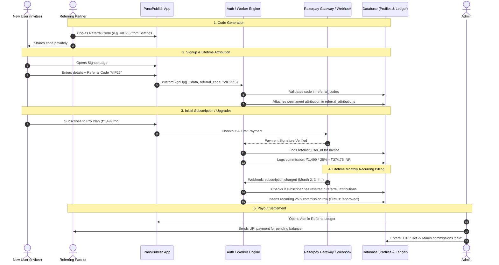

# PanoPublish Referral Program — Technical Implementation Plan
**Document Version:** 1.0.0  
**Program Type:** Code-Based Referral Program  
**Commission Rate:** 25% Lifetime Recurring Commission  
**Visibility:** Discreet / Integrated (No public marketing disclosures or "private program" banners)

---

## 1. Executive Summary & Core Rules

1. **Code-Based System Only:**
   - Referrals are tracked exclusively through unique alphanumeric referral codes (e.g. `PANO-PRASHANT` or custom codes).
   - No third-party affiliate cookie networks, external redirect scrapers, or tracking pixels.
   - Users enter the referral code during signup (or it auto-populates via `?ref=CODE` cleanly without aggressive tracking).

2. **25% Lifetime Recurring Commission:**
   - The referrer receives **25% of all subscription and credit revenue** generated by the referred user for the lifetime of their account.
   - Applies to:
     - First subscription checkout (`basic`, `pro`, `agency`).
     - Every recurring monthly renewal debited automatically via Razorpay (`subscription.charged`).
     - Pay-as-you-go extra tour credit purchases.

3. **Strictly Admin-Assigned Partner Access:**
   - The referral program is NOT open to or visible to all users.
   - Only users explicitly assigned a referral code by an admin via the Admin Panel (`/admin`) receive partner status.
   - Regular users do NOT see the "Referrals" tab in Settings, and codes are never auto-generated on signup or profile load.
   - If an unassigned user visits `/settings?tab=referrals`, they are gracefully redirected to the `"basic"` tab.
   - Once assigned by an admin, the partner's Settings dynamically reveals the "Referrals" tab with their unique code, share link, real-time commission ledger (25%), and UPI payout details.
   - Admins can assign or manage referral partners in 1 click from either the Users table or the Referrals tab in `/admin`.

---

## 2. Database Schema Architecture

The referral system is designed to work seamlessly across both PostgreSQL (Supabase) and SQLite (Cloudflare D1).

### 2.1 Schema Tables

```sql
-- 1. Referral Codes Table
CREATE TABLE IF NOT EXISTS public.referral_codes (
  id uuid PRIMARY KEY DEFAULT gen_random_uuid(),
  user_id uuid NOT NULL REFERENCES public.profiles(id) ON DELETE CASCADE,
  code text NOT NULL UNIQUE,
  commission_percent numeric(5,2) NOT NULL DEFAULT 25.00,
  is_active boolean NOT NULL DEFAULT true,
  notes text,
  created_at timestamptz NOT NULL DEFAULT now(),
  updated_at timestamptz NOT NULL DEFAULT now()
);

CREATE INDEX IF NOT EXISTS idx_referral_codes_code ON public.referral_codes(UPPER(code));
CREATE INDEX IF NOT EXISTS idx_referral_codes_user_id ON public.referral_codes(user_id);

-- 2. Referral Attributions Table (1-to-1 User Attribution)
CREATE TABLE IF NOT EXISTS public.referral_attributions (
  id uuid PRIMARY KEY DEFAULT gen_random_uuid(),
  referred_user_id uuid NOT NULL UNIQUE REFERENCES public.profiles(id) ON DELETE CASCADE,
  referrer_user_id uuid NOT NULL REFERENCES public.profiles(id) ON DELETE CASCADE,
  referral_code_id uuid NOT NULL REFERENCES public.referral_codes(id),
  attributed_code text NOT NULL,
  created_at timestamptz NOT NULL DEFAULT now()
);

CREATE INDEX IF NOT EXISTS idx_referral_attributions_referrer ON public.referral_attributions(referrer_user_id);
CREATE INDEX IF NOT EXISTS idx_referral_attributions_referred ON public.referral_attributions(referred_user_id);

-- 3. Referral Commissions Ledger
CREATE TABLE IF NOT EXISTS public.referral_commissions (
  id uuid PRIMARY KEY DEFAULT gen_random_uuid(),
  referrer_user_id uuid NOT NULL REFERENCES public.profiles(id) ON DELETE CASCADE,
  referred_user_id uuid NOT NULL REFERENCES public.profiles(id) ON DELETE CASCADE,
  payment_source text NOT NULL, -- 'razorpay_subscription' | 'razorpay_order'
  payment_reference_id text NOT NULL, -- payment_id or invoice_id
  plan_name text, -- 'basic' | 'pro' | 'agency' | 'credits'
  payment_amount_inr numeric(10,2) NOT NULL,
  commission_percent numeric(5,2) NOT NULL DEFAULT 25.00,
  commission_amount_inr numeric(10,2) NOT NULL,
  status text NOT NULL DEFAULT 'approved', -- 'pending' | 'approved' | 'paid' | 'void'
  payout_id uuid, -- linked when settled
  created_at timestamptz NOT NULL DEFAULT now()
);

CREATE INDEX IF NOT EXISTS idx_referral_commissions_referrer ON public.referral_commissions(referrer_user_id);
CREATE INDEX IF NOT EXISTS idx_referral_commissions_status ON public.referral_commissions(status);
CREATE INDEX IF NOT EXISTS idx_referral_commissions_ref_id ON public.referral_commissions(payment_reference_id);

-- 4. Referral Payouts Table
CREATE TABLE IF NOT EXISTS public.referral_payouts (
  id uuid PRIMARY KEY DEFAULT gen_random_uuid(),
  referrer_user_id uuid NOT NULL REFERENCES public.profiles(id) ON DELETE CASCADE,
  amount_inr numeric(10,2) NOT NULL,
  payout_method text NOT NULL DEFAULT 'upi', -- 'upi' | 'bank_transfer'
  payout_address text NOT NULL, -- e.g. user@okhdfcbank
  transaction_reference text NOT NULL, -- UTR / Razorpay transfer ID
  processed_by text NOT NULL, -- admin email
  notes text,
  paid_at timestamptz NOT NULL DEFAULT now()
);

-- 5. Referrer Profile Extension (Payout Settings)
ALTER TABLE public.profiles 
  ADD COLUMN IF NOT EXISTS referral_code text UNIQUE,
  ADD COLUMN IF NOT EXISTS payout_upi_id text,
  ADD COLUMN IF NOT EXISTS payout_account_name text,
  ADD COLUMN IF NOT EXISTS payout_bank_account text,
  ADD COLUMN IF NOT EXISTS payout_ifsc text;
```

---

## 3. End-to-End Architectural Flows



---

## 4. Implementation Steps & File Modifications

### Step 1: Database Migrations
- Create Supabase migration `20261004000000_create_referral_program.sql` with the 4 tables and RLS policies.
- Update `d1-schema.sql` with SQLite-compatible syntax for D1 Cloudflare Worker parity.
- Automatically generate a default referral code for existing paid users or let admin assign them.

### Step 2: Signup Attribution Flow
1. **Frontend (`src/routes/signup.tsx`):**
   - Read optional `?ref=...` URL parameter and initialize referral code state.
   - Add clean, non-intrusive input field:
     ```tsx
     <div className="space-y-1">
       <Label htmlFor="refCode" className="text-xs text-muted-foreground">
         Referral Code (Optional)
       </Label>
       <Input
         id="refCode"
         placeholder="e.g. CREATOR25"
         value={referralCode}
         onChange={(e) => setReferralCode(e.target.value.toUpperCase().trim())}
         className="font-mono uppercase text-sm"
       />
     </div>
     ```
2. **Backend Server Function (`src/lib/auth-server.ts`):**
   - Accept `referral_code` in `customSignUp` metadata.
   - Upon `customVerifyEmail` completing signup, verify code against `referral_codes`.
   - If valid, insert row into `referral_attributions` binding `(referred_user_id, referrer_user_id)`.

### Step 3: Razorpay Edge Function Commission Calculation
1. **Initial Subscription Verification (`verify_subscription`):**
   - Check if `user_id` exists in `referral_attributions`.
   - If found, calculate:
     `commission = round(plan_amount * 0.25, 2)`
   - Insert into `referral_commissions` with `payment_reference_id = razorpay_payment_id`.
2. **Recurring Subscriptions (`webhook -> subscription.charged`):**
   - When a recurring payment clears, query `referral_attributions` for the user.
   - Automatically log the 25% recurring commission with `payment_source = 'razorpay_subscription'`.
3. **Pay-As-You-Go Credits (`verify_order`):**
   - Award 25% commission on one-time extra credit orders as well.

### Step 4: Referrer Experience in Settings (`src/routes/settings.tsx`)
- Add a dedicated **"Referrals"** tab in Settings (accessible to logged-in users):
  - **Your Referral Code:** Large display card with one-click copy button.
  - **Performance Dashboard:**
    - Total Referred Users (count)
    - Active Subscriptions (count)
    - Lifetime Commission Earned (₹)
    - Unpaid / Available Balance (₹)
  - **Payout Preferences Form:**
    - UPI ID (e.g., `creator@okhdfcbank`)
    - Account Name & IFSC
  - **Commission History Table:**
    - Date, Type (Initial / Renewal / Credits), Plan, Commission Amount (₹), Status (`Approved` / `Paid`).

### Step 5: Admin Management Suite (`src/routes/admin.tsx`)
- Add a new **"Referrals"** tab to the existing Admin panel alongside Users, Subscriptions, and Coupons:
  - **Referral Code Generator:** Create custom codes for specific photographers/influencers with configurable commission rates (default 25%).
  - **Attributions Overview:** See who referred whom.
  - **Commission Ledger:** See all pending commissions grouped by referrer.
  - **Payout Execution Modal:** Settle commissions via UPI/Bank transfer, record transaction UTR number, and mark items as `paid`.

---

## 5. Security & Anti-Fraud Measures

1. **Self-Referral Prevention:**
   - Strict constraint: A user cannot enter their own referral code.
   - Normalized email and IP checks during signup validation.
2. **Duplicate Attribution Lock:**
   - `referral_attributions.referred_user_id` has a `UNIQUE` constraint. Once an account is bound to a referrer, it can never be changed or stolen.
3. **Refund / Dispute Protection:**
   - If a subscription is refunded within the trial/refund window, the corresponding commission record status can be marked as `void` by admin.
4. **Discretion Guarantee:**
   - No public sitemap indexation of referral landing pages.
   - Clean, professional styling that feels like a natural native feature rather than an aggressive multi-level marketing scheme.

---

## 6. Verification & Testing Checklist

- [ ] Valid referral code attaches attribution record to new profile upon signup.
- [ ] Invalid/expired referral code shows clear error without breaking user registration.
- [ ] Self-referral attempt is blocked with clear notification.
- [ ] Razorpay test checkout triggers 25% commission entry in `referral_commissions`.
- [ ] Razorpay webhook simulation (`subscription.charged`) creates recurring renewal commission.
- [ ] Referrer sees accurate balance and transaction history in `/settings`.
- [ ] Admin panel lists all pending payouts and updates status to `paid` upon entering UTR.
