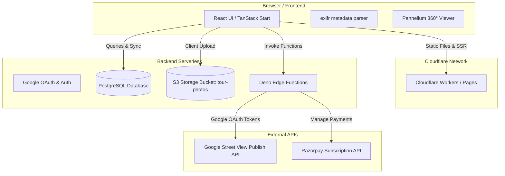
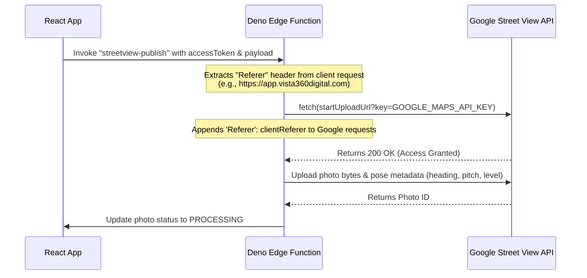

# TourVista — System Architecture & Technical Documentation

This document provides a comprehensive overview of the **TourVista** virtual tour manager application's architecture, technical stack, third-party integrations, and recent updates. It serves as a guide for any incoming software engineer to understand the system layout and design decisions.

---

## 🏗️ 1. High-Level Architecture

TourVista is structured as a modern **serverless, full-stack React application** split into two primary layers:



---

## 🛠️ 2. Technical Stack (What we used and why)

### Frontend & Server-Side Rendering (SSR)
1. **[TanStack Start](https://tanstack.com/router/v1/docs/start/overview)**: 
   - *Why*: A full-stack React framework built on top of **TanStack Router**. It enables Server-Side Rendering (SSR) for fast initial loads (essential for SEO) while maintaining a fast, SPA-like client-side state.
2. **[Vite](https://vite.dev/)**: 
   - *Why*: Serves as the bundler and dev server. Configured to build two targets: the client assets and the server-side Cloudflare Worker bundle.
3. **[Tailwind CSS v4](https://tailwindcss.com/)**: 
   - *Why*: Provides clean, responsive utility styling. V4 utilizes CSS-first configurations (`@theme`) and compiles using lightning-fast Rust-based transforms.
4. **[shadcn/ui & Radix UI](https://ui.shadcn.com/)**:
   - *Why*: Unstyled, accessible React primitives (Accordion, Dialogs, Buttons) styled with Tailwind classes for a premium dashboard feel.
5. **[Pannellum Viewer](https://pannellum.org/)**:
   - *Why*: An ultra-lightweight HTML5-based panoramic viewer used to display 360-degree equirectangular spheres in the browser.

### Backend & Database (Supabase)
1. **[PostgreSQL Database](https://www.postgresql.org/)**:
   - *Why*: Hosts application tables (tours, islands, photos, profiles, subscriptions) with strict relations.
2. **[Row-Level Security (RLS)](https://supabase.com/docs/guides/database/postgres/row-level-security)**:
   - *Why*: Ensures data isolation. Users and agencies can only read, write, or delete records where `user_id = auth.uid()`.
3. **[Supabase Storage](https://supabase.com/docs/guides/storage)**:
   - *Why*: Secure S3-compatible object storage hosting raw 360° photos and blurred nadir assets under the private `tour-photos` bucket.
4. **[Deno Edge Functions](https://supabase.com/docs/guides/functions)**:
   - *Why*: Executes serverless TypeScript scripts in low-latency runtime environments. Used for secure server-to-server operations (Google OAuth token exchanges and Razorpay billing verification).

### Third-Party APIs & Libraries
1. **[exifr](https://github.com/MikeK聲/exifr)**:
   - *Why*: Extracts geographic coordinates (GPS Latitude/Longitude) and pose directions (PoseHeading, Pitch, Roll) from JPEG binary buffers directly in the browser before upload.
2. **[imagescript (Deno)](https://deno.land/x/imagescript)**:
   - *Why*: A WebAssembly-accelerated image manipulation library. It is used in backend Edge Functions to apply nadir blurs, stretch filters, and overlay custom PNG logos without causing out-of-memory (OOM) crashes.

---

## 📂 3. Codebase Directory Structure

```text
├── .wrangler/               # Cloudflare Wrangler cache files
├── public/                  # Static assets (logo.svg, favicon.svg, sitemap.xml)
├── src/                     # Core client & server code
│   ├── components/          # Reusable UI elements (Logo, AppSidebar, SceneViewer)
│   ├── hooks/               # Custom React hooks (useStreetViewStatus, usePanoramaMap)
│   ├── integrations/        # Supabase client configurations and types
│   │   └── supabase/
│   │       ├── client.ts    # supabase-js client instance
│   │       └── types.ts     # Auto-generated database schema TypeScript definitions
│   ├── lib/                 # Core utility functions (formatting, auth contexts, env loaders)
│   ├── routes/              # TanStack Router file-based pages
│   │   ├── index.tsx        # SEO/LLM-optimized landing page
│   │   ├── dashboard.tsx    # User tour manager panel
│   │   ├── tours.$id/       # Dynamic nested tour management
│   │   │   ├── index.tsx    # Scene uploader & sorting interface
│   │   │   ├── location.tsx # Google Maps geographic tagger
│   │   │   └── connections.tsx # Virtual tour connector
│   │   │   └── publish.tsx  # Google Street View submission interface
│   │   ├── privacy.tsx      # Google OAuth compliant Privacy Policy
│   │   └── terms.tsx        # Subscription and Terms of Service page
│   ├── server.ts            # SSR entry point for Cloudflare Workers
│   └── styles.css           # Tailwind v4 import and custom OKLCH colors
├── supabase/                # Supabase configurations
│   ├── functions/           # Serverless edge function source code
│   │   ├── google-oauth/    # exchanges codes & refreshes Google Street View tokens
│   │   ├── razorpay/        # handles plan creation, payments, and webhooks
│   │   └── streetview-publish/ # process nadir images and submits to Google Maps
│   └── migrations/          # Version-controlled SQL schema modifications
└── wrangler.jsonc           # Cloudflare worker deployment configuration
```

---

## ⚡ 4. Core Technical Flows

### A. Google Street View Publishing (With Referrer Bypass)
Google Maps API keys are restricted by HTTP Referrer for security. However, serverless edge functions do not natively pass referrers. The system handles this seamlessly:



### B. Razorpay Billing & Webhook Synchronization
The billing system is designed to be self-healing and synchronized with database statuses:
1. **Static Plans**: Plan configuration maps directly to static plan IDs, avoiding recurring plan creations.
2. **Signature Verification**: Once the checkout modal finishes, the payment signature is verified using native Web Crypto HMAC-SHA256:
   ```typescript
   const text = `${paymentId}|${subscriptionId}`;
   // HMAC SHA-256 validation ensures verification requests cannot be spoofed
   ```
3. **Webhook Sync**: Razorpay sends POST events (`subscription.cancelled`, `subscription.halted`) directly to the webhook endpoint. The function validates the signature using the configured `RAZORPAY_WEBHOOK_SECRET` and automatically downgrades the user's `profiles.plan` to the `trial` tier.

---

## 🛠️ 5. Key Resolutions and Optimizations

### 1. Environment Variable Resolution Fix
In Cloudflare Workers, standard `import.meta.env` references compiled to `undefined` at build time. To fix this, we created a runtime resolution utility [env.ts](file:///d:/TourVista/vista-tour/src/lib/env.ts):
```typescript
export function getEnv(key: string): string {
  return (window as any).ENV?.[key] || (import.meta.env[key] as string);
}
```
In [__root.tsx](file:///d:/TourVista/vista-tour/src/routes/__root.tsx), the server dynamically injects variables from the environment into the HTML document's `window.ENV` script block, ensuring the frontend loads keys dynamically.

### 2. Database Type Synchronization
We generated complete TypeScript types directly from the remote database schema using:
```bash
npx supabase gen types typescript --project-id qxyfqyaenevpnmdtkoil > src/integrations/supabase/types.ts
```
This allowed us to eliminate unsafe code bypasses (like `as any`) on queries containing the newly added `order_index` database column.

---

## 🔍 6. Codebase Health & Future Audit Checklist

For future engineers, keep these items in mind when working on the project:
* **Google OAuth Compliance**: The Privacy Policy page **must** maintain a detailed explanation of the `https://www.googleapis.com/auth/streetviewpublish` scope to prevent Google from disabling the OAuth credentials.
* **Database Migrations**: Always execute schema changes using SQL migrations in `supabase/migrations/` rather than modifying the database directly in the Supabase UI. Remember to push them using `npx supabase db push` and regenerate type files afterward.
* **Large Image Uploads**: Image optimization and EXIF metadata extraction are done client-side. This keeps memory footprints inside Deno Edge Functions extremely small, avoiding Out of Memory (OOM) failures when uploading raw high-res panoramas.
