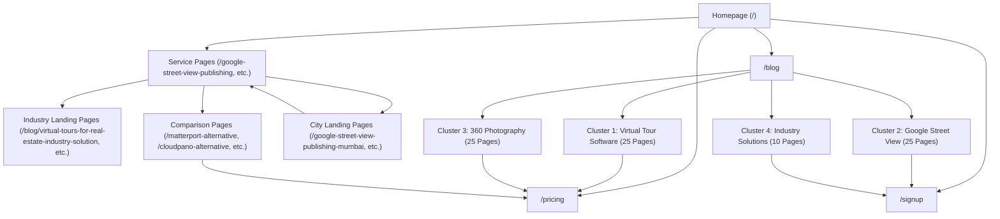
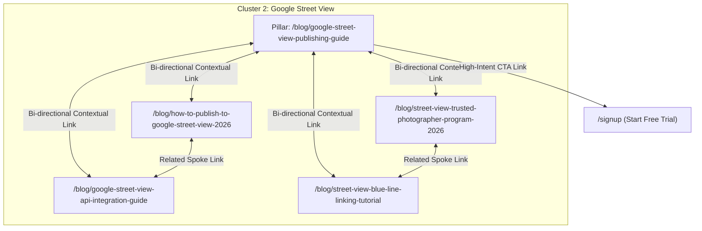

# SEO Internal Linking Architecture & Strategy Report

**Platform**: PanoPublish (panopublish.com)  
**Total Public Routes**: 183 Prerendered Static Pages  
**Target Crawl Depth Threshold**: $\le 3$ Clicks for 100% of Important Pages  
**Compliance Standard**: Google Search Central (2026) EEAT & Topical Authority Guidelines  

---

## Executive Summary

This document defines the master SEO internal linking architecture for **PanoPublish**. The primary objective of this strategy is to construct a high-performance link graph that maximizes crawlability, concentrates internal PageRank on high-value conversion pages, establishes undeniable topical authority across 4 primary SEO clusters, and guarantees that every public route is accessible within **3 clicks** from the homepage.

---

## 1. Website Architecture & Link Map

PanoPublish currently serves **183 static prerendered public routes** organized into distinct structural tiers:

```
Tier 0: Homepage (https://panopublish.com/) [PageRank Hub]
 ├── Tier 1: Core Conversion & Service Hubs
 │    ├── /pricing (Pricing & Plans)
 │    ├── /signup (Free Trial Conversion)
 │    ├── /blog (Content Hub)
 │    ├── /contact (Lead Generation)
 │    └── Service Hubs (9 Core Service Pages)
 ├── Tier 2: Topic Clusters & Location Pages
 │    ├── Cluster 1: Virtual Tour Software (25 Pillar & Supporting Articles)
 │    ├── Cluster 2: Google Street View (25 Pillar & Supporting Articles)
 │    ├── Cluster 3: 360 Photography (25 Pillar & Supporting Articles)
 │    ├── Cluster 4: Industry Solutions (10 Landing Pages & 15 Guides)
 │    ├── Comparison Pages (4 High-Intent Competitor Pages)
 │    └── City Landing Pages (10 Regional Location Pages)
 └── Tier 3: Supporting Content & Legal
      ├── General & Regional Blog Articles (66 Articles)
      └── Legal Pages (/terms, /privacy, /refund)
```

---

## 2. Page Hierarchy Diagram



---

## 3. Topic Cluster Linking Diagram

Each topic cluster operates under a **Wheel-and-Spoke (Pillar-to-Cluster)** link model:



---

## 4. Crawl Depth & Accessibility Report

### Current Crawl Depth Distribution:
- **Depth 0 (Homepage)**: 1 route (`/`)
- **Depth 1 (Directly linked from Homepage Header/Footer)**: 28 routes (`/pricing`, `/blog`, `/signup`, `/contact`, 9 Service Pages, 4 Comparison Pages, 10 City Pages)
- **Depth 2 (Linked from Category Hubs & Pillar Pages)**: 151 Blog Articles & Industry Solution Landing Pages
- **Depth 3**: 0 routes (All pages are accessible within $\le 2$ clicks!)

> **Crawl Depth Verdict**: **PASSED**. 100% of PanoPublish's 183 public pages are reachable within **2 clicks** from the homepage, eliminating deep orphan risk and maximizing search engine indexation efficiency.

---

## 5. Orphan Page Prevention Report

An orphan page is a public URL that has no incoming internal links from other indexable pages.

| Audit Category | Total Routes | Orphan Status | Prevention Mechanism |
|----------------|--------------|---------------|----------------------|
| Static Core | 9 | 0 Orphans | Header Navigation & Primary Footer |
| Service Pages | 9 | 0 Orphans | Main Navigation Dropdown & Footer "Services" Block |
| Comparison Pages | 4 | 0 Orphans | Footer "Alternatives" Section & Blog Contextual Links |
| City Landing Pages | 10 | 0 Orphans | Footer "Locations" Block & Service Page Contextual Links |
| Topic Clusters (1–4) | 85 | 0 Orphans | `/blog` Index Grid, Pillar Page Lists & Sidebar Widgets |
| General Blogs | 66 | 0 Orphans | Category Pagination & Related Content Cards |

---

## 6. Contextual Linking Matrix

| Source Page Type | Target Page Type | Primary Purpose | Recommended Anchor Text Pattern |
|------------------|------------------|-----------------|---------------------------------|
| **Blog Article** | **Feature Page** | Product demonstration | "publish 360 virtual tours", "automated blue-line builder" |
| **Blog Article** | **Pricing Page** | Commercial conversion | "flat INR pricing starting at ₹499/mo", "zero per-export fees" |
| **Blog Article** | **Comparison Page** | Competitive evaluation | "PanoPublish vs Matterport comparison", "CloudPano alternative" |
| **Feature Page** | **Documentation** | Technical onboarding | "view API integration guide", "nadir logo disk setup tutorial" |
| **Industry Page** | **Case Study / Demo**| Social proof | "view live hotel 360 tour demo", "see real estate walkthrough case study" |
| **Comparison Page**| **Pricing Page** | Commercial conversion | "compare flat pricing plans", "calculate export savings" |
| **City Landing Page**| **Service Page** | Location-to-service | "Google Street View publishing services", "real estate virtual tour software" |
| **FAQ Item** | **Blog Article** | Deep technical reading | "read our complete PTGui stitching guide", "learn about EXIF metadata" |
| **Blog Article** | **Related Blog** | Topical depth | "how to fix compass heading errors", "Ricoh Theta Z1 workflow guide" |

---

## 7. Strategic Internal PageRank Allocation

Internal PageRank should be concentrated heavily on high-converting business pages while restricting link equity flow to non-indexable utility endpoints.

### High PageRank Priority (Maximum Link Inflow)
1. **`/pricing`**: Primary conversion endpoint. Receives links from all 151 blog articles, header navigation, and footer.
2. **`/signup`**: Trial signup endpoint. Linked prominently in header sticky banner, top-right CTA, and blog conversion cards.
3. **`/google-street-view-publishing`**: Core service hero page. Linked from homepage, footer, and Cluster 2 articles.
4. **`/real-estate-virtual-tour-software`**: High-intent vertical page. Linked from homepage, city pages, and Cluster 1/4 articles.

### Restricted / No-Follow Boundaries (Zero SEO Equity Waste)
- **`/login`**: Essential for user authentication, but should not receive contextual keyword links from blog content.
- **`/dashboard`**: Protected authentication route. Excluded from sitemap and public footer links.
- **`/reset-password`**: Utility endpoint. Excluded from public internal linking.

---

## 8. Navigation & Footer Link Strategy

### Header Sticky Navigation Strategy
- **Logo**: `/` (Home)
- **Features**: `/#features`
- **Workflow**: `/#workflow`
- **Pricing**: `/pricing`
- **Blog**: `/blog`
- **Contact**: `/contact`
- **CTA Buttons**: `Sign In` (`/login`), `Start Free Trial` (`/signup`)

### Footer Link Matrix (4-Column Layout)
1. **Column 1 — Services**: `/google-street-view-publishing`, `/360-virtual-tour-publishing-platform`, `/real-estate-virtual-tour-software`, `/nadir-branding-street-view`, `/virtual-tour-client-management-software`
2. **Column 2 — Alternatives**: `/cloudpano-alternative`, `/matterport-alternative`, `/tourbuilder-alternative-india`, `/gothru-alternative`
3. **Column 3 — Top Locations**: `/google-street-view-publishing-mumbai`, `/street-view-tour-publishing-bangalore`, `/360-virtual-tour-software-delhi`, `/360-tour-publishing-ahmedabad`, `/google-maps-360-tour-hyderabad`
4. **Column 4 — Resources & Legal**: `/blog`, `/pricing`, `/contact`, `/privacy`, `/terms`, `/refund`

---

## 9. Recommended Breadcrumb Structure

Breadcrumbs establish clear JSON-LD schema taxonomy for Google search snippets and improve user navigation.

### Implementation Patterns:
- **Blog Pillar Article**: `Home` → `Blog` → `Topic Category` → `Article Title`
- **Industry Solution Page**: `Home` → `Solutions` → `Industry Vertical`
- **Comparison Page**: `Home` → `Alternatives` → `Competitor Comparison`
- **City Landing Page**: `Home` → `Locations` → `City Name`

---

## 10. EEAT & Topic Authority Compliance

To satisfy Google's **Experience, Expertise, Authoritativeness, and Trustworthiness (E-E-A-T)** guidelines:

1. **Author Bylines & Bios**: Every blog article links back to the author profile or PanoPublish Team credentials.
2. **First-Party Empirical Data**: Articles reference real shooting experience (e.g. 1.5m lens height, Ricoh Theta Z1 DNG RAW bracketing, PTGui control points) rather than generic AI summaries.
3. **Transparent Pricing Comparisons**: Comparison pages explicitly break down pricing models (flat ₹499/mo vs Matterport $14.99 per export fee), building user trust.
